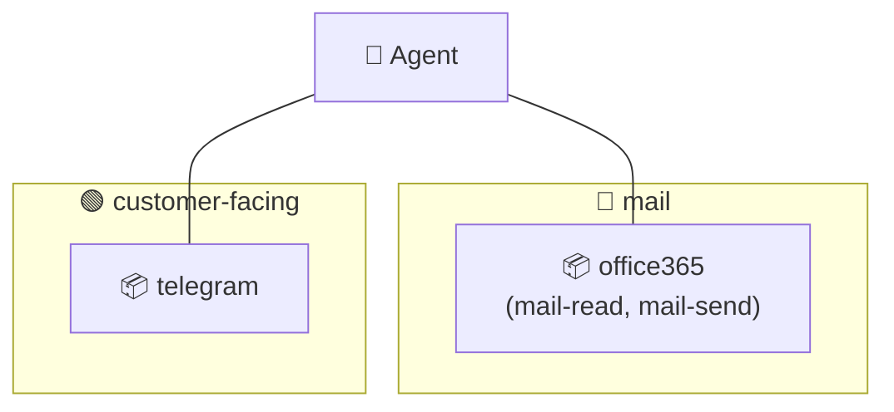
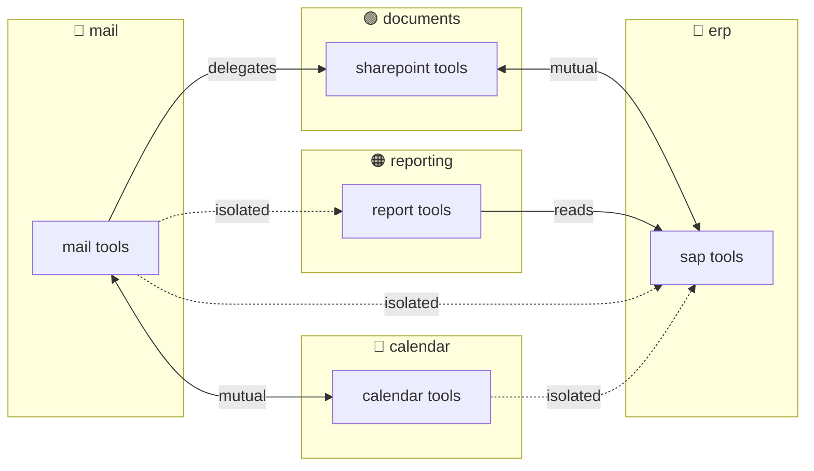
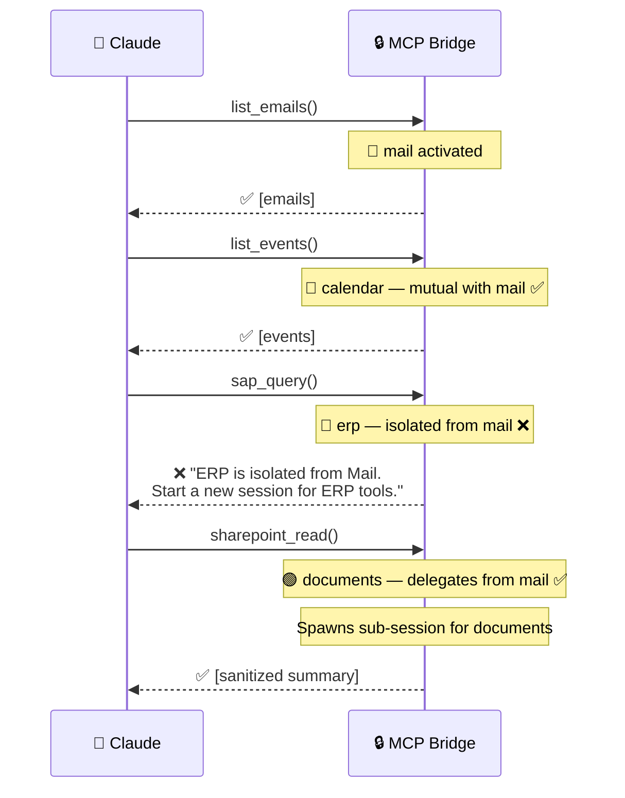
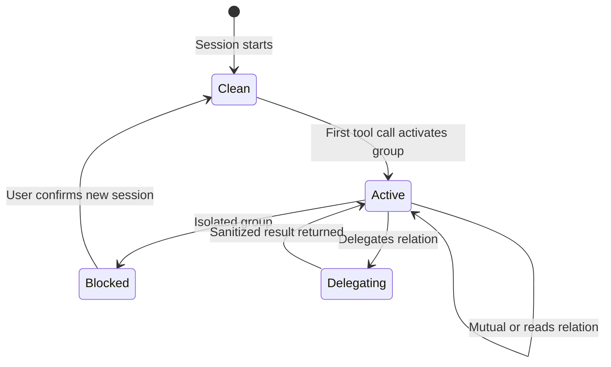
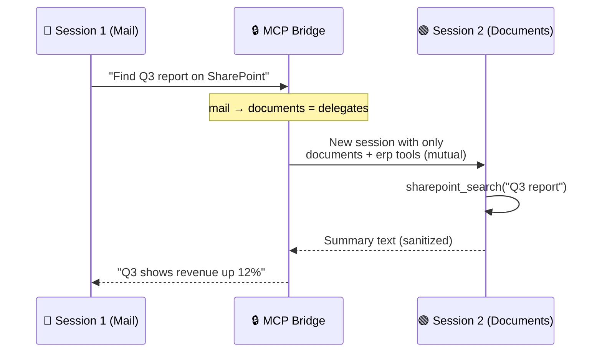

# Groups

Groups are the universal organizing concept in OpenHORT. A group is a named, colored set of rules that can contain llmings, tool permissions, user roles, taint labels, and session policies. Everything is a group — there is no separate "fence", "role", or "color" concept.

## What a Group Can Define

| Field | Purpose | Example |
|---|---|---|
| `color` | Visual identity in the UI | `blue`, `#3b82f6` |
| `llmings` | Which llmings (and which capability slices) belong | `office365: [mail-read, contacts]` |
| `powers` | Tool-level permissions for users in this group | `{ allow: all }` |
| `pulse` | Pulse data permissions | `{ allow: all }` |
| `session` | How sessions are managed | `shared`, `isolated` |
| `wire` | Wire-level permissions | `{ allow_cli: true }` |
| `taint` | Taint label applied to data flowing out | `source:mail` |
| `block_taint` | Taint labels blocked from flowing in | `[source:erp]` |
| `filters` | Active message filters | Regex, AI classifier, rate limiter |

A group uses **only the fields it needs**. A tool isolation group has `color` + `llmings` + `taint`. A user role group has `powers` + `session` + `wire`. A group can combine both.

## Overlapping Groups

A llming can belong to **multiple groups**. When groups overlap, rules intersect — all groups must allow a flow for it to proceed:



Office 365 is in both `mail` and `customer-facing`. Rules from **both** apply — most restrictive wins.

## Relations Between Groups

Groups are **isolated by default**. Relations override this:

| Relation | Data flow | Session | Use case |
|---|---|---|---|
| `isolated` | None (default) | Separate sessions required | Mail ↔ ERP |
| `mutual` | Bidirectional, free | Same session OK | Mail ↔ Calendar |
| `reads` | One-way only | Same session, read direction only | Reporting → ERP |
| `delegates` | Task in, sanitized result out | Sub-session spawned | Mail → Documents |

```yaml
relations:
  - groups: [mail, calendar]
    type: mutual

  - groups: [reporting, erp]
    type: reads
    direction: reporting -> erp

  - groups: [mail, documents]
    type: delegates
    direction: mail -> documents

  - groups: [erp, documents]
    type: mutual
```

### Relation Diagrams



## Enforcement: Two Layers

### Layer 1: Soul (Soft)

Auto-generated from the YAML. The agent sees all tools but understands the rules:

```markdown
You have access to tools organized in groups:
- 🔵 Mail: list_emails, read_email, send_email, contacts
- 🔵 Calendar: list_events, create_event (mutual with Mail)
- 🟢 Documents: sharepoint_list, sharepoint_read (mutual with ERP)
- 🔴 ERP: sap_query, sap_read (mutual with Documents)
- 🟠 Reporting: generate_report (reads ERP)

Relations:
- Mail ↔ Calendar: mutual (use together freely)
- Documents ↔ ERP: mutual (use together freely)
- Reporting → ERP: one-way (reporting can query ERP)
- Mail → Documents: delegate (send task, get summary)
- All other combinations: isolated

When isolated groups conflict, explain and offer a new session.
```

This text is **auto-generated from the YAML** — no manual Soul writing needed.

### Layer 2: MCP Bridge (Hard)

The MCP bridge tracks which groups are activated and enforces boundaries:



### Bridge State Machine



## Delegation Mechanism

When group A `delegates` to group B:



The sub-session gets all tools from the target group AND its mutual relations. Session 1 never sees raw SharePoint data. Session 2 never sees email content.

## Ungrouped Llmings

Llmings not in any group are **always available**. They carry no taint and work with any active group:

```yaml
llmings:
  lens:
    type: openhort/lens         # no group → always available

  clipboard:
    type: openhort/clipboard    # no group → always available

  system-monitor:
    type: openhort/system-monitor  # no group → always available
```

Utility llmings that don't handle sensitive data need no configuration.

## Complete YAML Example

```yaml
hort:
  name: "My Desktop"

llmings:
  telegram:
    type: openhort/telegram
    config:
      token: env:TELEGRAM_BOT_TOKEN

  wire:
    type: openhort/wire

  claude:
    type: openhort/claude-code
    config:
      model: claude-sonnet-4-6
      credentials: keychain
    envoy:
      container:
        image: openhort-claude-code
        memory: 2g

  lens:
    type: openhort/lens

  clipboard:
    type: openhort/clipboard

  office365:
    type: microsoft/office365
    config:
      client_id: env:AZURE_CLIENT_ID

  sap:
    type: sap/connector
    config:
      host: sap.internal:8443

  reporting:
    type: internal/reporting

groups:
  # --- Tool isolation groups (with colors) ---

  mail:
    color: blue
    llmings:
      office365: [mail-read, mail-send, contacts]
    taint: source:mail

  calendar:
    color: cyan
    llmings:
      office365: [calendar]

  documents:
    color: green
    llmings:
      office365: [sharepoint]

  erp:
    color: red
    llmings:
      sap: [query, read, write]
    taint: source:erp

  reporting:
    color: orange
    llmings:
      reporting: [generate, list, export]

  # --- User permission groups ---

  owner:
    powers: { allow: all }
    pulse: { allow: all }
    session: shared
    wire:
      allow_cli: true
      allow_admin: true

  viewer:
    powers:
      allow:
        openhort/lens: all
        openhort/system-monitor: all
    pulse:
      allow:
        openhort/system-monitor: all
    session: isolated
    wire:
      allow_cli: false
      allow_admin: false

relations:
  - groups: [mail, calendar]
    type: mutual

  - groups: [erp, documents]
    type: mutual

  - groups: [reporting, erp]
    type: reads
    direction: reporting -> erp

  - groups: [mail, documents]
    type: delegates
    direction: mail -> documents

users:
  michael:
    groups: [owner]
    match:
      telegram: alice_dev
      wire: user@example.com

  sarah:
    groups: [viewer]
    match:
      wire: sarah@company.com
```

## User Experience

The user never thinks about groups:

```
User: "What emails do I have?"
Claude: Uses 🔵 mail → shows emails

User: "Any meetings today?"
Claude: Uses 🔵 calendar → shows events (mutual with mail ✅)

User: "Find the project plan on SharePoint"
Claude: Delegates to 🟢 documents → gets summary (delegates ✅)

User: "What's our SAP revenue?"
Claude: "SAP is in a separate security group. I can't access it
         alongside your email session. Start a new session?"

User: "Sure"
Claude: [New session] Uses 🔴 ERP → shows revenue
        Also accesses 🟢 documents (mutual with ERP ✅)
```

Colors appear in the UI status bar so users can see which group context they're in.
