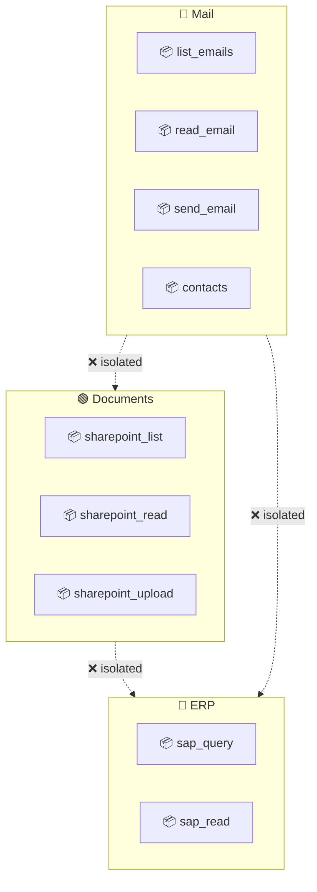
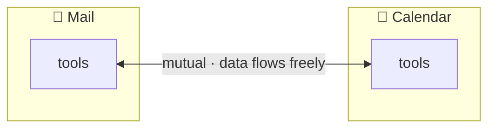
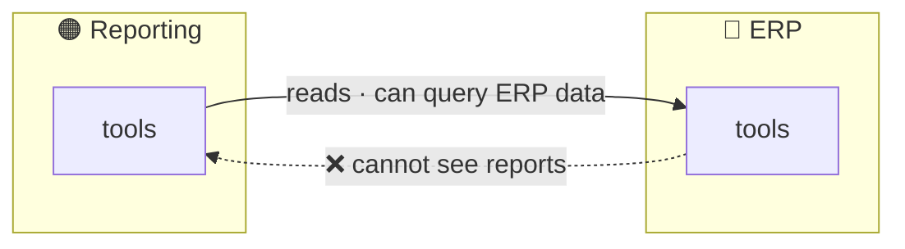
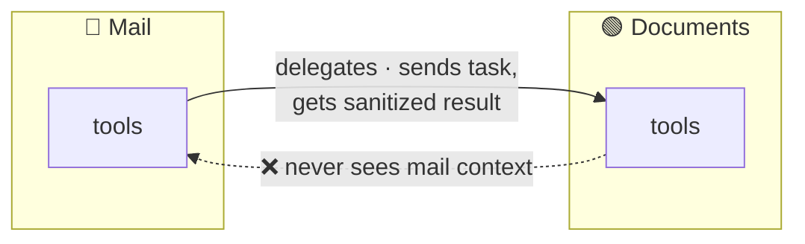
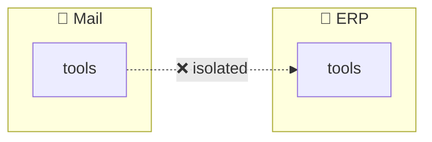
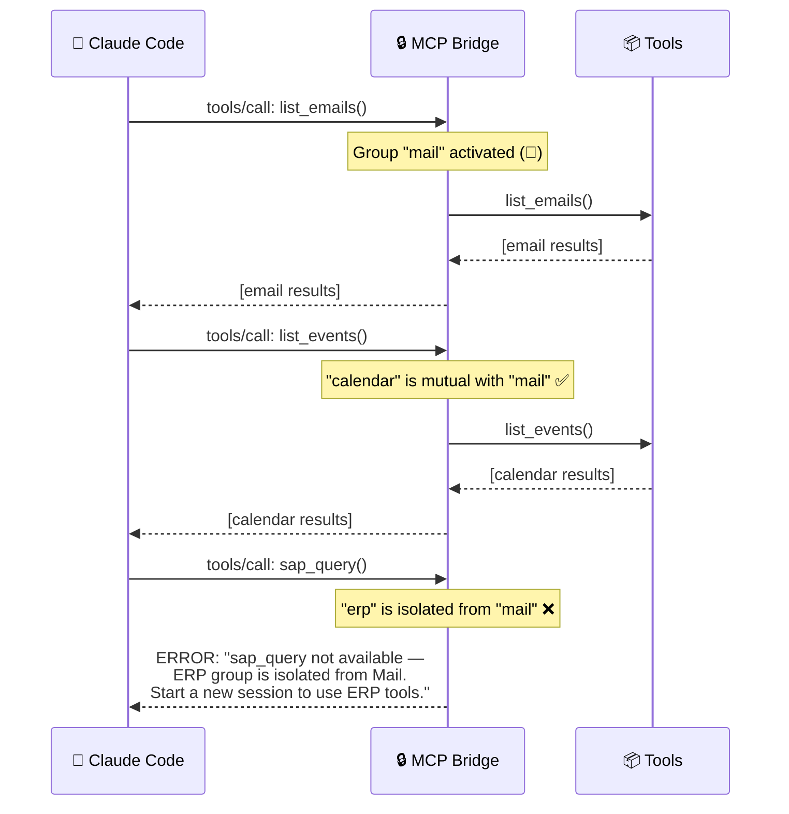
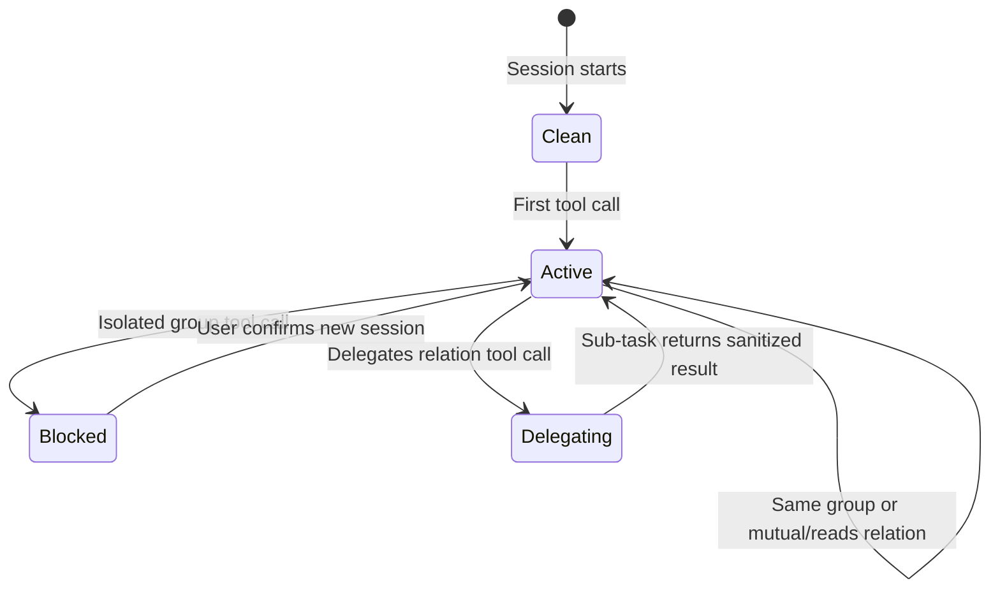
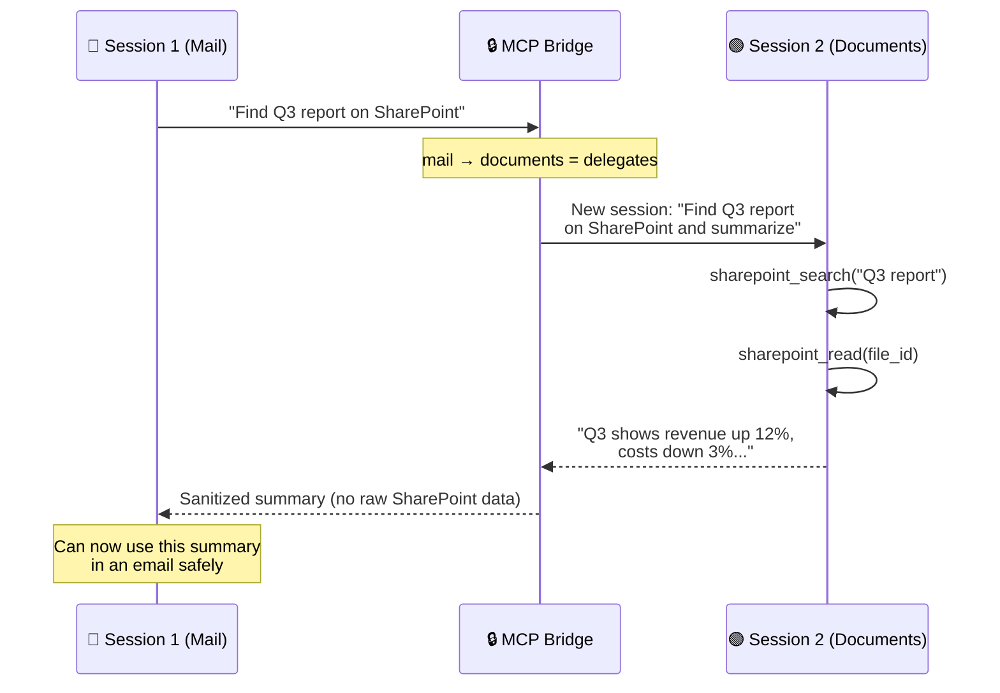

# Group Isolation

Groups define which llmings can work together within a session. Data flows freely inside a group but is controlled across group boundaries. Groups are the user-facing concept — they map to colors in the UI, auto-generate Soul instructions for agents, and are enforced by the MCP bridge as a hard safety net.

## Basic Concept



By default, groups are **isolated** — tools in one group cannot be used in the same session context as tools from another group.

## Group Relations

Groups can have explicit relations that override the default isolation:

### Relation Types

| Relation | Meaning | Example |
|---|---|---|
| `isolated` | Default. No data flow between groups. | Mail ↔ ERP |
| `reads` | One group can read the other's data, but not vice versa. | Reporting reads ERP, ERP can't see reports |
| `mutual` | Both groups work together freely. No taint boundary. | Calendar + Contacts |
| `delegates` | One group can send tasks to the other, receives only sanitized results. | Mail delegates to Documents |

### YAML Configuration

```yaml
groups:
  mail:
    color: blue
    llmings:
      office365: [mail-read, mail-send, contacts]

  calendar:
    color: cyan
    llmings:
      office365: [calendar]

  documents:
    color: green
    llmings:
      office365: [sharepoint]

  erp:
    color: red
    llmings:
      sap: [query, read]

  reporting:
    color: orange
    llmings:
      internal/reporting: [generate_report, list_reports]

relations:
  # Calendar and mail work together freely
  - groups: [mail, calendar]
    type: mutual

  # Reporting can read ERP data, ERP can't see reports
  - groups: [reporting, erp]
    type: reads
    direction: reporting -> erp

  # Mail can delegate document lookups, gets sanitized results
  - groups: [mail, documents]
    type: delegates
    direction: mail -> documents

  # Everything else is isolated by default (no relation = isolated)
```

### Relation Diagrams

#### Mutual



Both groups' tools available in the same session. No taint boundary. Used for groups that naturally belong together.

#### Reads (One-Way)



Reporting can call ERP tools and use the results. ERP tools never see reporting data. The read direction is enforced — data flows one way only.

#### Delegates



Mail can ask "find the Q3 report on SharePoint" — the agent runs a sub-task with only document tools, returns a clean summary. The document context never sees email content, and the full SharePoint response is summarized before returning to the mail context.

#### Isolated (Default)



No relation defined = fully isolated. Agent cannot use both in the same session. If the user asks to combine them, the agent explains and asks to start a new session.

## Enforcement: Two Layers

### Layer 1: Soul (Soft — Agent Self-Regulation)

The Soul instructions are **auto-generated from the YAML**. The agent sees all tools but understands the rules:

```markdown
You have access to tools organized in groups. Groups control
what data can flow where.

Groups:
- 🔵 Mail: list_emails, read_email, send_email, contacts
- 🔵 Calendar: list_events, create_event (mutual with Mail)
- 🟢 Documents: sharepoint_list, sharepoint_read
- 🔴 ERP: sap_query, sap_read
- 🟠 Reporting: generate_report, list_reports (reads ERP)

Relations:
- Mail ↔ Calendar: mutual (use together freely)
- Reporting → ERP: one-way read (reporting can query ERP)
- Mail → Documents: delegate only (send task, get summary back)
- All other combinations: isolated (cannot use in same session)

When the user asks to combine isolated groups:
1. Explain which groups are involved
2. Explain they are isolated for security
3. Offer to start a fresh session for the other group
```

This text is generated automatically — no manual Soul writing needed for group rules.

### Layer 2: MCP Bridge (Hard — Technical Enforcement)

The MCP bridge tracks which group was activated first and enforces boundaries:



Even if Claude ignores the Soul instructions (prompt injection, jailbreak), the MCP bridge blocks the call. The bridge is the hard enforcement layer.

### Bridge State Machine



## Delegation Mechanism

When group A `delegates` to group B:

1. Claude calls a tool from group B
2. Bridge intercepts — this is a delegation, not a direct call
3. Bridge spawns a **new Claude Code session** with only group B's tools
4. Passes only the task description (NOT the current conversation context)
5. Sub-session executes, returns result
6. Bridge summarizes/sanitizes the result
7. Returns clean result to the original session



Session 2 never sees email content. Session 1 never sees raw SharePoint data or file paths. Only the summarized result crosses the boundary.

## Complete Example

```yaml
hort:
  name: "My Desktop"

llmings:
  telegram:
    type: openhort/telegram
    config:
      token: env:TELEGRAM_BOT_TOKEN

  wire:
    type: openhort/wire

  claude:
    type: openhort/claude-code
    config:
      model: claude-sonnet-4-6
      credentials: keychain
    envoy:
      container:
        image: openhort-claude-code
        memory: 2g

  lens:
    type: openhort/lens

  office365:
    type: microsoft/office365
    config:
      client_id: env:AZURE_CLIENT_ID

  sap:
    type: sap/connector
    config:
      host: sap.internal:8443

  reporting:
    type: internal/reporting

groups:
  mail:
    color: blue
    llmings:
      office365: [mail-read, mail-send, contacts]

  calendar:
    color: cyan
    llmings:
      office365: [calendar]

  documents:
    color: green
    llmings:
      office365: [sharepoint]

  erp:
    color: red
    llmings:
      sap: [query, read, write]

  reporting:
    color: orange
    llmings:
      reporting: [generate, list, export]

  # Ungrouped llmings (lens, system-monitor, etc.) are always available
  # They have no taint and work with any group

relations:
  - groups: [mail, calendar]
    type: mutual

  - groups: [reporting, erp]
    type: reads
    direction: reporting -> erp

  - groups: [mail, documents]
    type: delegates
    direction: mail -> documents

users:
  michael:
    groups: [owner]
    match:
      telegram: alice_dev
      wire: user@example.com

  sarah:
    groups: [developer]
    match:
      wire: sarah@company.com
```

## Ungrouped Llmings

Llmings not assigned to any group (like `lens`, `clipboard`, `system-monitor`) are **always available** regardless of which group is active. They carry no taint and can be used alongside any group.

This is intentional — utility llmings that don't handle sensitive data should just work without configuration.

## User Experience

The user never thinks about groups. They just talk:

```
User: "What are my emails today?"
Claude: Uses 🔵 mail tools → shows emails

User: "Check if I have meetings"
Claude: Uses 🔵 calendar tools → shows events (mutual with mail ✅)

User: "Now pull up the SAP revenue numbers"
Claude: "SAP data is in a separate security group from your email session.
         I can't access both in the same conversation. Want me to start
         a fresh session for SAP?"

User: "Find the project plan on SharePoint"
Claude: Delegates to 🟢 documents → gets summary back → shows it
        (delegation allowed, raw data doesn't cross ✅)
```

The colors appear in the UI status bar so the user can see which group context they're in.
