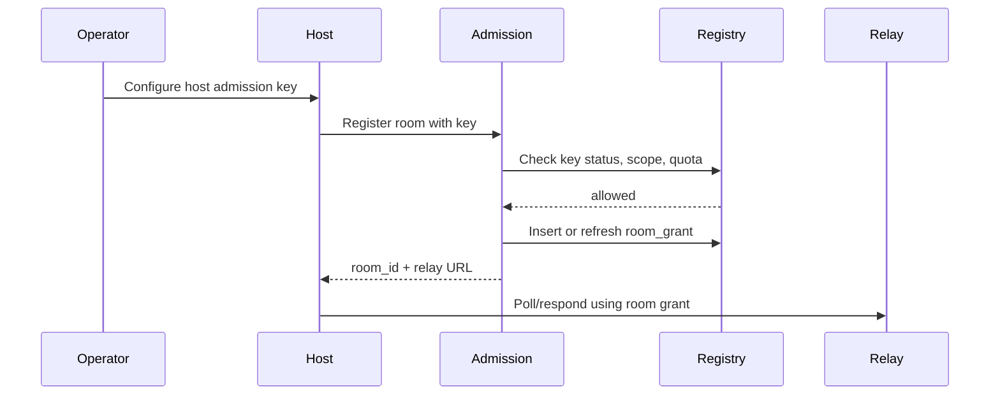
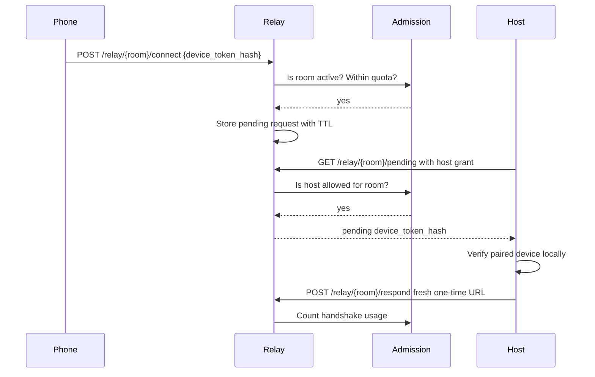

# P2P Session Admission and Host Authorization

This document defines the public OpenHort security model for deciding which
host apps are allowed to create P2P handshakes and proxy sessions.

The P2P relay must not be treated as a free anonymous mailbox.  The relay is
only signaling infrastructure, but signaling is still a public resource and a
security-sensitive entry point.  The host still verifies device/app secrets and
one-time P2P tokens before it exposes anything, but every deployment should also
enforce admission before it prepares a handshake.

This file is intentionally white-labeled.  Deployment-specific policy,
commercial packaging, and managed-service concepts belong outside the OpenHort
repository.

## Repository Ownership

OpenHort is not the canonical home for generic P2P or proxy transport code.
OpenHort is about isolated execution and orchestration of agentic services.  It
uses P2P and proxy transport as access paths into those services, but the
transport layer itself should stay shared.

The intended split is:

| Repository | Owns |
|---|---|
| `llming-com` | Shared P2P/proxy protocol, relay contract, server-side relay backends, pairing state machine, reconnect logic, DataChannel proxy protocol, remote access tunnel primitives, MCP transports, and browser viewer assets. Current shared paths are `llming_com/p2p/admission.py`, `llming_com/p2p/proxy.py`, `llming_com/access/remote.py`, `llming_com/mcp/`, `llming_com/server/p2p/relay/cloudflare/`, and `llming_com/static/p2p/`. |
| `openhort` | Agent-service execution, isolation, OpenHort host integration, OpenHort-specific config, llming orchestration, and docs that explain how OpenHort consumes the shared transport. |
| OpenHort commercial/private | Managed account provider, billing, tenants, production policy, abuse handling, customer limits, and commercial dashboards. |

New generic transport work should start in `llming-com`.  OpenHort should import
or wrap it.  If a generic relay, viewer, or proxy implementation exists in
OpenHort or the website repository, treat it as compatibility or migration debt
until it can move into `llming-com`.

The public developer contract must remain deployment-neutral:

```text
endpoint + admission key + same transport client
```

Switching from the managed service to a private deployment, or back, should be a
configuration change.

## Goals

- A host app can provide a handshake or proxy session only when it has an
  accepted host admission key.
- Host/app development is deployment-neutral.  A developer configures an
  endpoint and one admission key, then uses the same shared transport client to
  create pairing links, register rooms, issue one-time links, and complete
  handshakes.
- Moving between the managed OpenHort service and a private deployment must be a
  configuration change, not an application rewrite.
- Non-managed deployments can use one or more API keys.  A key may be shared by
  several apps or dedicated to one app.
- Every deployment has basic security: hashed secrets, TTLs, rate limits,
  backoff, and revocation.
- The public OpenHort implementation contains all essential white-labeled files.
- Custom deployments can plug in policy, quota, and identity providers through
  git-ignored config and import paths.
- Host admission does not replace device authorization.  Paired device tokens,
  one-time P2P tokens, and reconnect tokens remain separate checks.

## Terminology

- **Admission endpoint**: base URL of the relay or hub deployment, for example
  `https://relay.openhort.ai`, `https://hub.openhort.ai/relay`, or a private
  Worker URL.
- **Host app**: an OpenHort/llming app running on a machine and polling/listening
  for P2P connection requests.
- **Host admission key**: secret configured on a host app.  A deployment accepts
  it before that host can prepare handshakes or proxy sessions.
- **Room**: relay namespace used for pending requests, responses, and SDP
  messages.
- **Room grant**: durable server-side authorization record saying a host key may
  use a room.
- **Viewer credential**: paired-device secret stored on the phone.  This is not a
  host admission key.
- **Handshake**: relay traffic that prepares a fresh WebRTC connection.
- **Admission provider**: pluggable code that checks host keys, quotas, TTLs,
  revocation, and rate limits.
- **Pairing token**: opaque bootstrap credential encoded in a QR code.  It is
  short-lived and single-use.
- **Paired device credential**: longer-lived browser-side credential stored
  after pairing.  It is used to request future handshakes without rescanning a
  QR code.

## Current Gap

An ungated relay accepts arbitrary room IDs.  That means anybody can use the
public relay as a signaling mailbox for their own room.

That does not automatically give access to another user's machine because the
host validates one-time tokens and paired-device tokens.  However, anonymous room
creation is still wrong for a controlled service:

- it allows free use of relay resources;
- it makes abuse harder to attribute;
- it makes paid quotas impossible;
- it prevents clean account-level revocation;
- it lets attackers create many rooms and stress Durable Objects.

## Required Security Boundary

The host and relay must enforce admission before accepting any operation that
creates state, prepares a handshake, or opens a proxy path.

Protected operations:

- host room registration or refresh;
- host polling for pending device requests;
- host response with fresh one-time URLs;
- SDP inbox/send operations;
- WebSocket upgrade to a relay room;
- local creation of one-time P2P links;
- local pairing-token issuance;
- any DataChannel proxy session creation.

Public operations may remain:

- `/health`
- `/cfversion`
- static viewer page reads

## Default OpenHort Mode

The default mode should be API-key based and dependency-light:

- `p2p-admission.local.yaml` stores local key material and policy.
- The file is git-ignored.
- Stored keys are hashes, not plaintext.
- A deployment can configure one key for all apps or multiple named keys.
- A key can optionally be scoped to room IDs, app IDs, origins, or allowed
  operations.
- Revoking a key immediately prevents new handshakes and proxy sessions.
- Existing WebRTC sessions may continue until their normal TTL unless the
  deployment explicitly closes them.

Example local shape:

```yaml
admission:
  provider: local_api_keys
  keys:
    - id: personal-main
      secret_hash: sha256:...
      scopes: ["room:*", "handshake:create", "proxy:create"]
      limits:
        rooms: 3
        handshakes_per_minute: 12
        auth_failures_per_minute: 20
```

## Stable Developer Contract

The host/app side must not branch on "managed" versus "private".  It always
receives the same two deployment values:

```yaml
p2p:
  endpoint: "https://relay.openhort.ai"
  admission_key: "${OPENHORT_ADMISSION_KEY}"
```

The same code should work when pointed at a private endpoint:

```yaml
p2p:
  endpoint: "https://relay.example.com"
  admission_key: "${OPENHORT_ADMISSION_KEY}"
```

The shared transport boundary should look like this:

```python
client = LlmingP2PClient(
    endpoint=config.p2p.endpoint,
    admission_key=config.p2p.admission_key,
)

room = await client.register_room(app_id="com.example.host", app_name="Example")
qr = client.create_pairing_qr(room)
request = await client.poll_pending(room)
link = await client.create_one_time_link(room, request)
await client.respond(room, request, link)
```

Commercial deployments may apply account, billing, tenant, and quota rules
behind that endpoint.  Private deployments may validate a static key from local
config.  The caller still sees the same endpoint/key/client contract.

Deployment switching must be operationally trivial:

```bash
# Managed
OPENHORT_RELAY_ENDPOINT=https://relay.openhort.ai
OPENHORT_ADMISSION_KEY=oh_live_...

# Private
OPENHORT_RELAY_ENDPOINT=https://relay.example.com
OPENHORT_ADMISSION_KEY=oh_private_...
```

No host code should import commercial modules, inspect commercial account data,
or care whether the provider is backed by KV, D1, Postgres, Stripe, a YAML file,
or another system.

## Opaque QR And Stable Viewer URLs

QR codes are bootstrap credentials, not durable app URLs.

The QR should contain only an opaque pairing token:

```text
https://openhort.ai/p2p/pair#pt=<opaque-pairing-token>
```

The fragment is preferred for browser-based pairing because it is not sent in
the HTTP request line.  The token still appears on the device and can be captured
from screenshots, so it must be short-lived and single-use.

The QR page flow is:

```text
QR scan
  -> static pairing page
  -> page reads #pt
  -> page redeems pairing token
  -> page stores paired device credential in IndexedDB/cookie storage
  -> page redirects to stable viewer URL
```

The stable URL should not contain secrets:

```text
https://openhort.ai/p2p/app
```

or, for a self-hosted deployment:

```text
https://relay.example.com/p2p/app
```

The stable viewer page owns the intelligence:

1. read the paired device credential from IndexedDB, local storage, or cookies;
2. discover or remember the relay endpoint and room/app metadata;
3. ask the host/relay for a fresh handshake;
4. reconnect after reload, tab restore, or phone deep sleep;
5. show a login/pairing prompt only when no valid credential exists.

Metadata such as app name, icon, favicon URL, tenant, plan, or host label should
not be encoded into the QR URL.  It can be returned after the pairing token is
validated.

### Credential Lifetimes

Recommended defaults:

| Credential | Purpose | Default TTL |
|---|---|---|
| Pairing token | Bootstrap a new paired device | 60-300 seconds, single-use |
| Paired device credential | Let the same browser request future handshakes | at least 1 day, configurable |
| One-time connection token | Authorize one WebRTC/proxy handshake | about 60 seconds |
| Reconnect grant | Recover from reload/sleep/network interruption | configurable, commonly 1-24 hours |

It is fine for the QR to expire immediately after use.  It is not fine for the
post-pairing page to become unusable after a reload.  Once paired, the stable
viewer URL should remain bookmarkable until the paired device credential expires
or is revoked.

### Login-Initiated Handshakes

Username/password login is a separate authorization source that should still use
the same transport handshake path.

Flow:

```text
Phone opens stable app URL
  -> user logs in
  -> app lists reachable hosts/services
  -> user selects a service
  -> backend asks host to prepare a fresh handshake
  -> viewer connects using the same P2P/proxy transport client
```

The host may require that remote access is enabled, that the service is running,
and that pairing or authenticated remote access is allowed.  The login layer
does not replace the transport layer; it only authorizes the request for a fresh
handshake.

## Public Relay HTTP Contract

All relay deployments expose the same paths.  The path prefix may differ, but the
operation names must remain stable.

For a dedicated relay origin:

```text
POST /{room}/register
POST /{room}/connect
GET  /{room}/pending
POST /{room}/respond
GET  /{room}/response?h={device_token_hash}
GET  /{room}/sdp-inbox
POST /{room}/sdp-send
GET  /{room}/config
WS   /{room}
```

For a combined hub origin:

```text
POST /relay/{room}/register
POST /relay/{room}/connect
GET  /relay/{room}/pending
POST /relay/{room}/respond
GET  /relay/{room}/response?h={device_token_hash}
GET  /relay/{room}/sdp-inbox
POST /relay/{room}/sdp-send
GET  /relay/{room}/config
WS   /relay/{room}
```

Host-only operations require admission:

```http
Authorization: Bearer <host-admission-key>
```

The relay may also accept `X-Llming-Admission-Key` for environments where
generic bearer handling is awkward. `X-OpenHort-Admission-Key` can remain as a
compatibility alias during migration. Query-string admission keys should be
avoided because URLs leak into logs and browser history.

Viewer operations do not receive the host admission key.  They are allowed only
after the host has registered the room and only inside the room TTL:

- `POST /connect`
- `GET /response`
- WebSocket upgrade for SDP exchange

This prevents anonymous room creation while keeping QR-code and browser viewer
flows simple.

## Room Registration

Before a host polls or responds, it registers or refreshes a room:

```http
POST /{room}/register
Authorization: Bearer <host-admission-key>
Content-Type: application/json

{
  "app_id": "com.example.host",
  "app_name": "Example Host",
  "ttl_ms": 3600000
}
```

Response:

```json
{
  "ok": true,
  "room": "room_abc",
  "expires_at": 1799999999999,
  "config": {
    "poll_interval_ms": 5000,
    "app_poll_interval_ms": 3000,
    "request_ttl_ms": 60000
  }
}
```

The room grant is relay-side state saying the admitted host key may use that
room until `expires_at`.  Hosts should refresh well before expiry.  A private
deployment can keep this in memory or Durable Object storage.  Managed
deployments should keep account-level ownership and quota state outside the room
object, then project the authorization result into the room grant.

## Cloudflare Worker Deployment

The reusable server-side relay assets live in `llming-com` under role-first
directories. Cloudflare is one backend:

```text
llming_com/server/p2p/relay/cloudflare/
```

OpenHort may deploy that Worker for `relay.openhort.ai`, but the deployable
technique stays shared.

The Worker uses hashed admission keys.  Generate a secret and store only its
SHA-256 hash in Worker configuration:

```bash
openssl rand -base64 32
printf '%s' "$OPENHORT_ADMISSION_KEY" | shasum -a 256
```

Configure:

```toml
[vars]
HOST_ADMISSION_KEY_HASHES = "sha256:<hex-sha256>"
```

Multiple keys may be comma-separated:

```toml
[vars]
HOST_ADMISSION_KEY_HASHES = "sha256:<hash-a>,sha256:<hash-b>"
```

If no admission hash is configured, production relay operations must fail closed.
`/health` stays public.

Recommended public domain layout:

```text
https://www.openhort.ai        static website and public documentation
https://openhort.ai            redirect or same static website
https://apps.openhort.ai       paired-device app launcher and continuation UI
https://relay.openhort.ai      P2P relay only
https://hub.openhort.ai        hosted access UI plus /relay/{room}/... paths
https://api.openhort.ai        optional stable REST/control API
https://test-apps.openhort.ai  isolated apps launcher for public integration tests
https://test-relay.openhort.ai disabled-by-default integration-test relay
```

Do not rely on path routing under `www.openhort.ai` for service APIs.  Keeping
the website, app, API, and relay on different origins makes cookies, CORS,
Cloudflare cache rules, rate limits, and incident isolation simpler.

`relay.openhort.ai` and `hub.openhort.ai/relay` must stay protocol-compatible.
The host SDK should treat both as relay endpoints and derive paths from the same
client code.

### Replacing The Public Relay

A production relay replacement must be done in this order:

1. Deploy Worker code that supports `/register` and admission checks.
2. Configure `HOST_ADMISSION_KEY_HASHES`.
3. Verify unauthenticated room operations fail:
   - `POST /{room}/register` -> `401` or `503`
   - `GET /{room}/pending` -> `401` or `403`
   - `POST /{room}/connect` before registration -> `403`
4. Verify an admitted host can register a room:
   - `POST /{room}/register` with `Authorization: Bearer ...` -> `200`
5. Verify viewer operations work only for the registered room.
6. Update host/app config to point at the endpoint and key.

The replacement is considered safe only when anonymous callers can no longer
create room state on `relay.openhort.ai`.

### Self-Hosted Deployment

A private deployment uses the same Worker and the same host configuration:

```bash
export OPENHORT_RELAY_ENDPOINT=https://relay.example.com
export OPENHORT_ADMISSION_KEY=oh_private_...
```

The operator may run the Worker on Cloudflare, another Worker-compatible
runtime, or a FastAPI implementation that follows the same contract.  The
provider may load key hashes from:

- Worker vars;
- a git-ignored YAML file;
- environment variables;
- SQLite/Postgres/D1/KV;
- an imported Python class implementing the public `AdmissionProvider`
  interface.

The host SDK must not know which storage backend is used.

## Test App And Relay Domains

Full integration tests should exercise an actual public-style deployment without
touching production app or relay state.  Use dedicated test origins:

```text
https://test-apps.openhort.ai
https://test-relay.openhort.ai
```

The apps origin is the browser/user-facing side.  It owns cookies,
IndexedDB/local storage, pairing-token redemption, the recent apps list, and the
continue-session UI.  The relay origin is infrastructure only.  A full
browser-flow test therefore needs both test subdomains.

The test relay must be disabled by default.  CI or a manual test run enables it
with a short expiry:

```text
LLMING_TEST_RELAY_ENABLED_UNTIL=2026-05-17T09:15:00Z
```

The Worker must reject all relay operations on the test origin when that value is
missing or in the past.  Test setup should:

1. deploy or configure the test Worker with a short `LLMING_TEST_RELAY_ENABLED_UNTIL`;
2. configure a temporary admission key hash;
3. run the public P2P/proxy integration tests from `https://test-apps.openhort.ai`
   against
   `https://test-relay.openhort.ai`;
4. clear the enable flag or set it to a past timestamp in teardown.

This gives end-to-end coverage for the open, self-hostable path while making it
hard to accidentally leave a free public relay online.

The test relay should use a separate admission key from production.  Test keys
must have short TTLs, should be generated per run when practical, and must not be
accepted by production domains.

For the OpenHort-managed domains, the website/deployment repository contains the
Cloudflare zone notes and existing relay Worker configs:

```text
/Users/michael/projects/openhort_platform/www_openhort_ai/CLAUDE.md
/Users/michael/projects/openhort_platform/www_openhort_ai/workers/relay/wrangler.toml
/Users/michael/projects/openhort_platform/www_openhort_ai/workers/relay/wrangler.test.toml
```

That local setup records the `openhort.ai` Cloudflare account/zone IDs and a
test route for `test-relay.openhort.ai/*`. Before any live test, verify the DNS
records still exist for both `test-apps.openhort.ai` and
`test-relay.openhort.ai`, and verify the Worker route is attached to the test
Worker. Do not reuse the production `apps.openhort.ai` or `relay.openhort.ai`
routes for public-version tests.

The shared Cloudflare backend includes helper scripts for this pattern:

```text
llming_com/server/p2p/relay/cloudflare/scripts/run-test-relay.sh
llming_com/server/p2p/relay/cloudflare/scripts/disable-test-relay.sh
```

The intended CI/manual pattern is:

```bash
export LLMING_TEST_RELAY_ROUTE='test-relay.openhort.ai/*'
export LLMING_TEST_APPS_HOST='test-apps.openhort.ai'
export LLMING_TEST_RELAY_ADMISSION_HASH='sha256:<hex-sha256>'
export LLMING_TEST_RELAY_WINDOW_SECONDS=900

./scripts/run-test-relay.sh -- pytest tests/test_public_relay_e2e.py
```

The script deploys the enabled config, runs the command, and deploys the
disabled config again through an `EXIT` trap. Production relay routes must not be
used for this.

The Worker still accepts the older `OPENHORT_TEST_RELAY_ENABLED_UNTIL` variable
as a migration alias, but new deployments should use the `LLMING_*` names
because the relay is shared infrastructure.

## Private Provider Boundary

The public repository may define technical hooks such as:

- `AdmissionProvider`
- `QuotaProvider`
- `UsageRecorder`
- `RoomGrantStore`
- `HostKeyStore`

It must not contain managed-service business rules.  The following belong in the
private concept or commercial implementation repository:

- paid plan names and prices;
- billing provider details;
- tenant/account lifecycle;
- customer-specific room, handshake, or auth limits;
- abuse review process;
- commercial dashboard behavior;
- production secrets and live customer configuration.

The public docs can say that a managed provider may enforce quotas.  They should
not say which commercial plans exist or what limits they receive.

## Pluggable Admission

The shared transport layer should expose a small public interface and allow
custom implementations to be loaded from git-ignored config:

```python
class AdmissionProvider:
    async def authorize_host(self, request: HostAdmissionRequest) -> HostGrant: ...
    async def authorize_handshake(self, request: HandshakeAdmissionRequest) -> None: ...
    async def record_usage(self, event: AdmissionUsageEvent) -> None: ...
```

Configuration can point at a custom class:

```yaml
admission:
  provider: import
  class: my_company.openhort_admission:Provider
```

The public contract stays stable.  Deployment-specific classes and config stay
outside the OpenHort repository, and commercial policy stays outside
`llming-com` as well.

## Registry Architecture

Use a central **Room Registry** before routing to relay room state.

```text
Request
  -> Admission middleware
  -> Room Registry lookup
  -> Quota/rate checks
  -> Relay room state
```

Relay room state should only handle already-authorized traffic.  Key ownership,
quotas, and revocation should live outside the room object so they are easy to
query and update.

## Data Model

Local development can use a JSON file.  Shared deployments should use a durable
store such as SQLite, Cloudflare D1, Postgres, or another backend provided by an
`AdmissionProvider`.

### host_keys

Store only hashes of host secrets.

```sql
CREATE TABLE host_keys (
  id TEXT PRIMARY KEY,
  secret_hash TEXT NOT NULL,
  label TEXT NOT NULL,
  status TEXT NOT NULL, -- active, revoked
  scopes_json TEXT NOT NULL,
  created_at INTEGER NOT NULL,
  last_used_at INTEGER
);
```

### room_grants

```sql
CREATE TABLE room_grants (
  room_id TEXT PRIMARY KEY,
  host_key_id TEXT NOT NULL,
  app_id TEXT NOT NULL,
  app_name TEXT NOT NULL,
  app_icon TEXT,
  status TEXT NOT NULL, -- active, revoked, expired
  created_at INTEGER NOT NULL,
  expires_at INTEGER,
  last_seen_at INTEGER,
  FOREIGN KEY(host_key_id) REFERENCES host_keys(id)
);
```

### usage_counters

```sql
CREATE TABLE usage_counters (
  subject_id TEXT NOT NULL,
  period TEXT NOT NULL, -- YYYY-MM or YYYY-MM-DD
  rooms_created INTEGER NOT NULL DEFAULT 0,
  active_rooms INTEGER NOT NULL DEFAULT 0,
  handshakes INTEGER NOT NULL DEFAULT 0,
  auth_failures INTEGER NOT NULL DEFAULT 0,
  relay_messages INTEGER NOT NULL DEFAULT 0,
  PRIMARY KEY(subject_id, period)
);
```

## Limits and Brute-Force Protection

All modes should implement:

- constant-time secret comparison;
- hashed storage for host keys and paired device tokens;
- per-key and per-IP failure counters;
- exponential backoff after repeated failures;
- short TTLs for one-time P2P tokens;
- bounded reconnect token TTLs;
- replay prevention for one-time URLs;
- max pending connection requests per room;
- max SDP messages per minute;
- max active rooms per host key;
- max handshakes per minute per host key and per room;
- audit events for key use, rejection, revocation, and quota denial.

## Room Registration Flow



```text
room_id = base64url(random 128 bits)
host_secret = base64url(random 256 bits)
```

The deployment may allow callers to provide stable room IDs only when the
admission provider explicitly approves that scope.

## Handshake Flow With Admission



## Implementation Checklist

- Keep shared relay/proxy/viewer primitives in `llming-com`, with server
  backends under role-first paths such as
  `llming_com/server/p2p/relay/cloudflare/`.
- Add an `AdmissionProvider` interface and local API-key provider in the shared
  transport layer.
- Add git-ignored `p2p-admission.local.yaml` loading.
- Require host admission before:
  - `/api/p2p/connect`
  - `/api/p2p/pair`
  - relay pending/respond/sdp operations
  - DataChannel proxy session creation
- Add tests for:
  - accepted and rejected host keys;
  - key revocation;
  - brute-force backoff;
  - quota denial;
  - paired-device auth still required after host admission.
- Keep managed or deployment-specific policy outside this repository.
