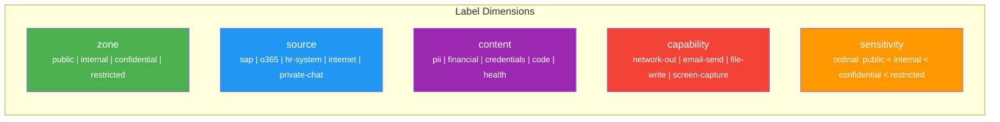
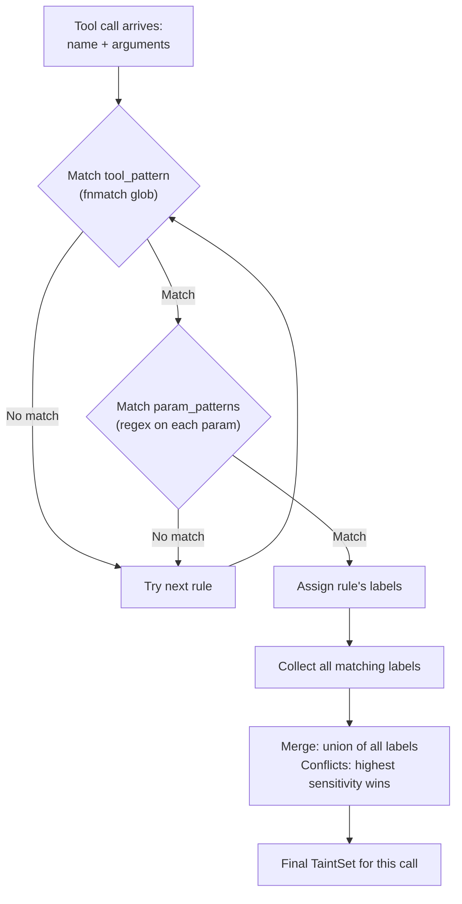
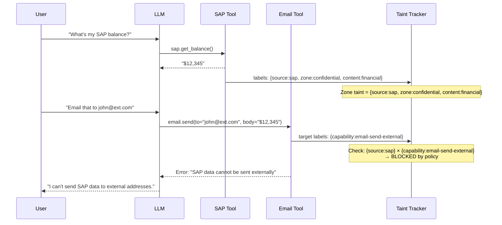
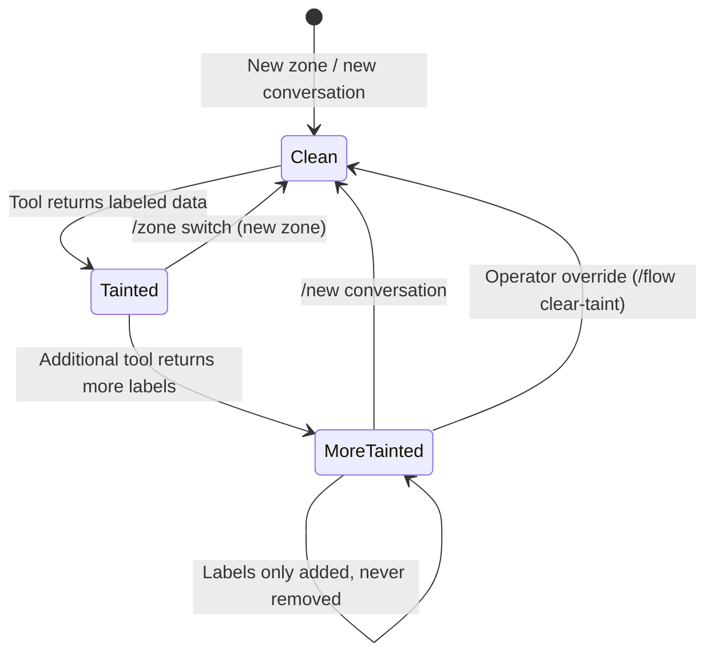
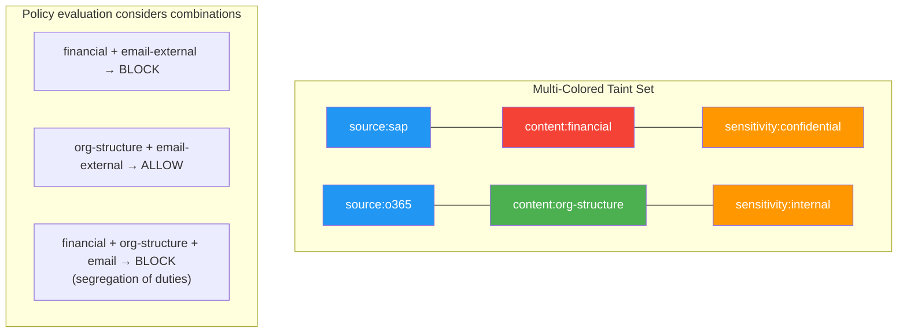
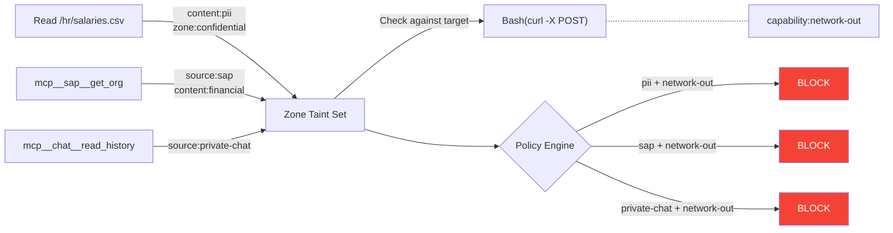

# Taint Tracking & Classification

Taint tracking assigns **security labels** to data as it flows through the system and propagates those labels through the conversation. The label classifier determines what labels a tool call produces based on the tool name and its parameters.

## Data Model

### Security Labels

A label is a typed key-value pair with five dimensions:



| Dimension | Purpose | Example values |
|-----------|---------|----------------|
| `zone` | Isolation boundary | `public`, `internal`, `confidential`, `restricted` |
| `source` | Data origin system | `sap`, `o365`, `hr-system`, `internet`, `private-chat` |
| `content` | Data content type | `pii`, `financial`, `credentials`, `code`, `health` |
| `capability` | Tool action type | `network-out`, `email-send`, `file-write`, `screen-capture` |
| `sensitivity` | Ordinal comparison | `public` < `internal` < `confidential` < `restricted` |

### Taint Set

A **taint set** is the collection of all labels attached to a piece of data. It uses set union for propagation -- combining data A (labels {x}) with data B (labels {y}) produces data with labels {x, y}.

```python
class TaintSet(BaseModel, frozen=True):
    labels: frozenset[SecurityLabel]
    tool_chain: tuple[str, ...]   # ordered list of tools that touched this data
```

!!! info "Lattice join"
    Taint propagation is a **monotonic lattice join** -- labels can only be added, never removed within a zone. This is the standard information flow control model from Denning (1976). It guarantees that sensitivity only increases as data is combined, never decreases.

### Security Envelope

Every data flow through the system has a parallel tracking structure (the **envelope**). The envelope does not wrap the actual data payload -- it is stored separately, keyed by conversation + zone.

```python
class SecurityEnvelope(BaseModel):
    taint: TaintSet
    conversation_id: str
    zone_id: str
    source_tool: str          # tool that produced this data
    source_params_hash: str   # SHA-256 of params (not raw -- may be sensitive)
    created_at: datetime
```

## Label Classifier

The classifier assigns labels to tool calls using pattern matching on the tool name and its arguments.

### Classification Rules

```python
class ClassificationRule(BaseModel):
    tool_pattern: str                    # glob pattern: "mcp__sap__*", "Bash", "Read"
    param_patterns: dict[str, str] = {}  # parameter name -> regex pattern
    labels: list[SecurityLabel]          # labels to assign when rule matches
    priority: int = 0                    # higher priority wins on conflict
```

### Classification Process



1. Extract tool name and arguments from the `tools/call` request
2. Match tool name against each rule's `tool_pattern` using `fnmatch` (same glob matching used in `hort/signals/bus.py`)
3. For matching rules, check `param_patterns` -- each parameter name maps to a regex that must match the stringified argument value
4. Collect all labels from all matching rules
5. If multiple rules assign conflicting `sensitivity` levels, take the highest (lattice join)

### Parameter-Level Classification Examples

The same tool produces different labels depending on its arguments:

=== "File Read"

    ```yaml
    classification_rules:
      - tool_pattern: "Read"
        param_patterns:
          file_path: "^/workspace/public/.*"
        labels:
          - {dimension: zone, value: public}
      
      - tool_pattern: "Read"
        param_patterns:
          file_path: "^/workspace/hr/.*"
        labels:
          - {dimension: zone, value: confidential}
          - {dimension: content, value: pii}
      
      - tool_pattern: "Read"
        param_patterns:
          file_path: "^/workspace/finance/.*"
        labels:
          - {dimension: zone, value: confidential}
          - {dimension: content, value: financial}
    ```

=== "Bash Commands"

    ```yaml
    classification_rules:
      - tool_pattern: "Bash"
        param_patterns:
          command: "^curl\\s.*-X\\s*GET"
        labels:
          - {dimension: source, value: internet}
          - {dimension: zone, value: public}
      
      - tool_pattern: "Bash"
        param_patterns:
          command: "curl.*(-X\\s*POST|-d\\s)"
        labels:
          - {dimension: capability, value: network-out}
      
      - tool_pattern: "Bash"
        param_patterns:
          command: "^git\\s+(status|log|diff|show)"
        labels:
          - {dimension: zone, value: internal}
    ```

=== "MCP Tools"

    ```yaml
    classification_rules:
      - tool_pattern: "mcp__sap__*"
        labels:
          - {dimension: source, value: sap}
          - {dimension: zone, value: confidential}
          - {dimension: content, value: financial}
      
      - tool_pattern: "mcp__o365__read_*"
        labels:
          - {dimension: source, value: o365}
          - {dimension: zone, value: internal}
      
      - tool_pattern: "mcp__o365__send_email"
        labels:
          - {dimension: capability, value: email-send}
      
      - tool_pattern: "mcp__openhort__get_system_metrics"
        labels:
          - {dimension: zone, value: public}
    ```

=== "Email with Domain Filtering"

    ```yaml
    classification_rules:
      # Email to internal domain -- safe
      - tool_pattern: "mcp__email__send"
        param_patterns:
          to: "@mycompany\\.com$"
        labels:
          - {dimension: capability, value: email-send-internal}
        priority: 10
      
      # Email to external domain -- dangerous
      - tool_pattern: "mcp__email__send"
        labels:
          - {dimension: capability, value: email-send-external}
        priority: 0
    ```

### Built-in Default Rules

The system ships with sensible defaults that cover common tools:

| Tool pattern | Param pattern | Labels |
|-------------|---------------|--------|
| `Write` | *(any)* | `capability:file-write` |
| `Edit` | *(any)* | `capability:file-write` |
| `Bash` | `command: "curl.*-X POST"` | `capability:network-out` |
| `Bash` | `command: "curl.*-d "` | `capability:network-out` |
| `Bash` | `command: "wget "` | `capability:network-out` |
| `mcp__*__send_email` | *(any)* | `capability:email-send` |
| `mcp__*__send_message` | *(any)* | `capability:network-out` |

User configuration extends or overrides these defaults. Higher-priority rules take precedence.

## Taint Propagation

### How Labels Flow Through a Conversation



### Propagation Rules

1. **Tool output taints the zone**: When a tool returns data in zone Z, the tool's output labels are unioned into Z's taint set.

2. **LLM output inherits zone taint**: Any text the LLM produces while in zone Z carries Z's full taint. This is conservative -- the LLM has "seen" all data in the zone and could encode any of it in its output.

3. **Tool input carries zone taint**: When the LLM calls a tool, the call carries the zone's accumulated taint. The policy engine checks this combined taint against the target tool's labels.

4. **Taint never decays**: Within a zone, taint only grows. Once data is tainted, the zone stays tainted for the lifetime of the conversation (or until a zone switch).



### Multi-Colored Taint

Taint is not a single "dirty/clean" flag or a single sensitivity level. It is **multi-dimensional** — each label carries independent information about origin, content type, and sensitivity. This is critical because:

1. **Same source, different colors**: SAP org chart (`content:org-structure`, `sensitivity:internal`) and SAP financial data (`content:financial`, `sensitivity:confidential`) are both `source:sap` but require completely different handling
2. **Low + low = high**: Employee directory (`content:employee-directory`, `sensitivity:internal`) + email send (`capability:email-send`) are individually low-risk but catastrophic together (mass phishing)
3. **Context-dependent danger**: Private chat data + display to user = fine; private chat data + curl POST = disaster. The **same data** has different risk depending on where it flows.



Each "color" (dimension + value) is independently tracked and independently policy-checked. The policy engine evaluates both simple pairs (source × target) and **combinations** (multiple taint labels present simultaneously). See [Combination Policies](flow-policies.md#combination-policies-non-linear-danger).

### Why Conservative Propagation?

!!! warning "The LLM is a black box"
    We cannot inspect what the LLM "remembers" from previous tool results. If it has seen SAP data, it could encode that data in a natural-language response, as hidden text in an email, or as parameter values in a subsequent tool call. Therefore, the only safe assumption is that **everything the LLM produces after seeing sensitive data is potentially tainted**.

This is the fundamental reason tool-level permissions are insufficient: the LLM's context window is a mixing bowl. Once sensitive data enters the context, there is no way to guarantee it doesn't leak through a subsequent tool call.

### Multi-Tool Taint Chains

Labels accumulate across multiple tool calls:



### What the LLM Sees

The LLM is unaware of the flow control system. It calls tools normally. When a policy blocks a call, the LLM receives a standard MCP error:

```json
{
  "jsonrpc": "2.0",
  "id": 42,
  "error": {
    "code": -32600,
    "message": "Flow policy violation: Data labeled 'source:sap' cannot reach tool with 'capability:network-out'. Policy: no-sap-to-network. To proceed, ask the operator to approve this data flow."
  }
}
```

The LLM then naturally explains the restriction to the user. No special prompt engineering is needed -- Claude already handles tool errors gracefully.

## Interception Points

The classifier and taint tracker hook into two existing boundaries:

### MCP Proxy (`hort/sandbox/mcp_proxy.py`)

For proxied MCP servers (SSE protocol), the `McpSseProxy._check_request()` method already intercepts every `tools/call` request. The flow system adds a second check after the existing tool filter:

```python
# Existing: tool allow/deny filter
error = self._check_request(msg)
if error:
    return error

# New: flow policy check
error = self._check_flow_policy(msg, conversation_id, zone_id)
if error:
    return error
```

### MCP Bridge (`hort/mcp/bridge.py`)

For in-process LLMing tools, the `MCPBridge.handle_message()` method at the `tools/call` branch is the interception point. Same classification and policy check.

### Chat Session (`hort/ext/chat_backend.py`)

The `ChatSession` owns the per-conversation taint state. The taint tracker is stored as an attribute and persisted to `session.meta.user_data` for conversation resume.

## Audit Trail

Every flow-relevant event produces a structured audit record:

```json
{
  "ts": "2026-04-02T14:30:00Z",
  "event": "tool_call",
  "conversation_id": "conv-abc123",
  "zone": "public",
  "user_id": "telegram:12345",
  "tool": "mcp__sap__get_balance",
  "params_hash": "sha256:a1b2c3...",
  "labels_assigned": [
    {"dimension": "source", "value": "sap"},
    {"dimension": "zone", "value": "confidential"}
  ],
  "zone_taint_before": [],
  "zone_taint_after": [
    {"dimension": "source", "value": "sap"},
    {"dimension": "zone", "value": "confidential"}
  ],
  "policy_decision": "allow",
  "auto_escalation": "public -> confidential"
}
```

```json
{
  "ts": "2026-04-02T14:30:05Z",
  "event": "policy_violation",
  "conversation_id": "conv-abc123",
  "zone": "confidential",
  "user_id": "telegram:12345",
  "tool": "Bash",
  "params_hash": "sha256:d4e5f6...",
  "labels_assigned": [
    {"dimension": "capability", "value": "network-out"}
  ],
  "policy_name": "no-sap-to-network",
  "policy_action": "block",
  "policy_message": "SAP data cannot be sent over network",
  "matched_source_labels": [{"dimension": "source", "value": "sap"}],
  "matched_target_labels": [{"dimension": "capability", "value": "network-out"}]
}
```

Storage: JSONL at `~/.openhort/audit/flow-YYYY-MM-DD.jsonl`, daily rotation, 90-day retention.

!!! tip "Tool params are hashed, not stored"
    The audit log stores a SHA-256 hash of tool parameters, not the raw values. This prevents the audit log itself from becoming a data leak vector while still enabling correlation and investigation.

## Next

- [Flow Policies](flow-policies.md) -- policy engine, isolation zones, configuration, broadcast channels
- [Boundary Filters](boundary-filters.md) -- content inspection, network egress, MCP filter chains
