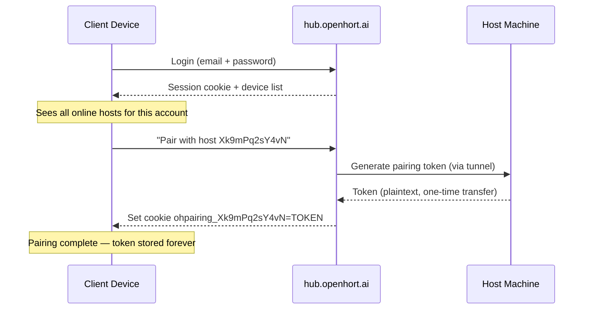
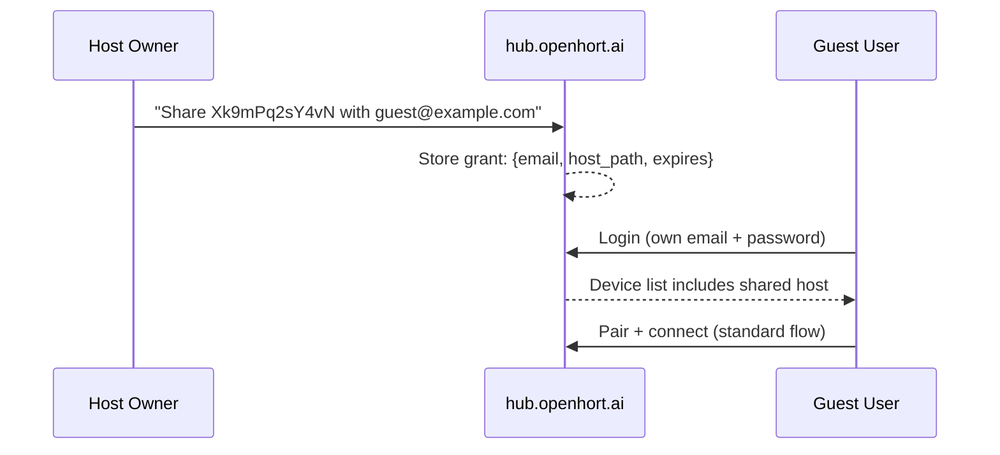

# Unified Access Model

How devices discover, pair with, and connect to openhort hosts — across LAN, cloud proxy, and P2P.

## Identity Model

Three fixed-length IDs compose every connection:

| ID | Length | Derived from | Stored |
|---|---|---|---|
| **uphid** | 12 chars | `sha256(email + password)[:12]` base62 | Nowhere (recomputed from credentials) |
| **device_uid** | 12 chars | Random base62, generated once per host machine | `~/.hort/device_uid` on host |
| **pairing_token** | 12 chars | Random base62, generated per client+host pair | Cookie on client, hash on host |

All IDs are 12 characters, base62 (`[A-Za-z0-9]`). At 12 chars base62, entropy is ~71 bits — unguessable by brute force.

### Host Path

Concatenation of device_uids encodes the routing chain. No delimiters — length tells you the depth:

```
Xk9mPq2sY4vN                             → main host (12 chars)
Xk9mPq2sY4vNaB3cD7eF8gHi                 → sub-hort via main host (24 chars)
Xk9mPq2sY4vNaB3cD7eF8gHijK5lM6nO9pQr     → nested: host → VM → container (36 chars)
```

The router splits every 12 characters:

```python
def resolve_hops(path_id: str, chunk=12) -> list[str]:
    return [path_id[i:i+chunk] for i in range(0, len(path_id), chunk)]
# "Xk9mPq2sY4vNaB3cD7eF8gHi" → ["Xk9mPq2sY4vN", "aB3cD7eF8gHi"]
# First hop: tunnel to host Xk9mPq2sY4vN
# Second hop: host routes to target aB3cD7eF8gHi
```

### Room ID (P2P)

```
room = sha256(uphid + device_uid)[:16]
```

Deterministic — same user + same host always produces the same room. The relay never sees credentials.

## URL Scheme

### Cloud Proxy

```
https://hub.openhort.ai/proxy/Xk9mPq2sY4vN/viewer                   → main host
https://hub.openhort.ai/proxy/Xk9mPq2sY4vNaB3cD7eF8gHi/viewer      → sub-hort
```

### P2P (short URL)

```
https://p2p.openhort.ai/ROOM/TOKEN                       → one-time link
https://p2p.openhort.ai/ROOM                              → paired device (token in cookie)
```

### Deep Link (native apps)

```
openhort://pair?token=TOKEN&room=ROOM&relay=RELAY
```

## Pairing

Pairing binds a **client device** to a **host machine**. One client can pair with many hosts. One host can be paired with many clients.

### Pairing Token Properties

- 12 characters, URL-safe, typeable
- Stored as SHA-256 hash on the host (plaintext never stored server-side)
- Stored in cookie on the client (`ohpairing_{device_uid}`), valid 6 months
- Garbage collected after 6 months of no use (last_seen timestamp updated on each connection)
- One client stores dozens of tokens (one per paired host)

### Pairing Flow



### After Pairing

The client can connect via:

1. **Username + password** — logs in, selects host, connects (pairing token sent automatically from cookie)
2. **One-time link** — short URL with embedded token, no login needed (link expires in 60s)
3. **QR code** — encodes the one-time link

The pairing token is **never re-entered**. It lives in the cookie and is sent automatically.

### Without Pairing

Connection is impossible. No pairing token = no access. This applies to:

- Cloud proxy (hub.openhort.ai)
- P2P (p2p.openhort.ai)
- LAN (any client not on localhost/0.0.0.0)

**Exception:** `localhost` and `0.0.0.0` clients skip pairing (direct local access).

## Guest Access

A host owner can share specific machines with other users. Guests get full access to the shared host — no permission scoping for now.

### Guest Invitation



### Grant Model

```yaml
grant:
  email: "guest@example.com"
  host_path: "Xk9mPq2sY4vN"          # main host or sub-hort
  expires: "2026-07-01"               # optional
```

- Guest gets full access to the granted host_path
- Access to a sub-hort does **not** grant access to the parent
- Owner can revoke at any time
- Standard pairing flow — guest needs their own pairing token

## Hub Device List

When a user logs into hub.openhort.ai, they see all hosts their account can access:

```
┌─────────────────────────────────────────────────┐
│  My Machines                                     │
│                                                  │
│  🟢 My MacBook          [Proxy] [P2P]    │
│     └─ 🟢 Linux VM             [Proxy] [P2P]    │
│     └─ 🔴 Windows Azure        [Offline]         │
│                                                  │
│  Shared with me                                  │
│                                                  │
│  🟢 Office Server              [Proxy]           │
│     └─ 🟢 Dev Container        [Proxy]           │
└─────────────────────────────────────────────────┘
```

Each host shows available connection methods:

- **Proxy** button — if tunnel WebSocket is connected to hub
- **P2P** button — if relay room is active (host is polling)
- Both buttons require the client to be paired

Sub-horts are shown indented under their parent. Clicking connects through the parent automatically (the host_path encodes the chain).

## Share Links

Temporary, scoped access to specific content — no pairing, no account needed. Just a link.

### Use Case

> Open LlmingLens, select two windows, click "Share" → get a link. Send it to anyone. They see only those two windows. You see their name in your status bar. Revoke anytime.

### How It Works

A share link encodes: what content, what permissions, who created it, when it expires.

```
https://hub.openhort.ai/s/Xk9mPq2sY4vN/7fJ2kL9mNqR4
                           ↑ host_path    ↑ share_token (12 chars)
```

Short enough to text. Works via proxy, P2P, or LAN:

```
hub.openhort.ai/s/{host_path}/{share_token}         → proxy
p2p.openhort.ai/s/{room}/{share_token}               → P2P
192.168.x.x:8940/s/{share_token}                     → LAN
```

### Share Model

```yaml
share:
  token: "7fJ2kL9mNqR4"
  host_path: "Xk9mPq2sY4vN"
  created_by: "user@example.com"
  scope:                                   # what the guest can see/do
    llming: "llming-lens"
    params:
      windows: [42, 67]                    # specific window IDs
  guest_name: "Sarah"                      # optional — pre-filled for the guest
  expires: "2026-04-07T18:00:00Z"          # optional TTL
  max_connections: 3                       # optional limit
  revoked: false
```

### Scope is Llming-Generic

Each llming defines what "shareable content" means:

| Llming | Scope Example |
|---|---|
| **llming-lens** | `{windows: [42, 67]}` — specific windows |
| **llming-wire** | `{conversation: "abc123"}` — specific chat |
| **clipboard-history** | `{read_only: true}` — view clipboard |
| **code-watch** | `{session: "main"}` — specific code session |
| **hosted-app** | `{app: "workflows"}` — specific hosted app |

The share system is generic — implemented at the llming-com protocol level, not per-llming. Any llming that speaks llming-com is automatically shareable. The protocol handles connection lifecycle (establish, track, revoke) and permission enforcement. Individual llmings just declare what content types they expose.

### Guest Experience

1. Guest opens share link
2. Sees a name prompt: "Enter your name to connect" (pre-filled if host set `guest_name`)
3. Connects — sees ONLY the shared content, nothing else
4. Host sees guest's name in the status bar with a revoke button

### Host Experience

1. Select content in any llming (e.g., pick windows in LlmingLens)
2. Click "Share" → choose expiry (1h, 24h, 7d, custom)
3. Get link — copy or show QR
4. Status bar shows: `Sarah viewing (2 windows) [x]`
5. Click `[x]` to revoke instantly

### No Auth Required

Share links are self-contained. No pairing, no account, no cookies. The token in the URL IS the auth. This makes them:

- Easy to share via text/email/chat
- Work for anyone (no openhort account needed)
- Automatically expire
- Instantly revocable

### Security

- Share tokens are 12 chars base62 (~71 bits) — unguessable
- Scoped to specific content — guest cannot navigate outside the share
- Host sees all active share connections in real-time
- Revocation is immediate (token deleted from host)
- No device fingerprint stored — truly ephemeral access

## Connection Methods Summary

| Method | URL Pattern | Auth | Pairing Required |
|---|---|---|---|
| LAN (localhost) | `http://localhost:8940/` | None | No |
| LAN (other IP) | `http://192.168.x.x:8940/` | Pairing token | Yes |
| Cloud Proxy | `hub.openhort.ai/proxy/{host_path}/` | Session + pairing | Yes |
| P2P | `p2p.openhort.ai/{room}/{token}` | One-time token | Sets pairing |
| P2P (paired) | `p2p.openhort.ai/{room}` | Cookie | Already paired |
| Deep Link | `openhort://pair?token=...` | Token | Sets pairing |
| Share (proxy) | `hub.openhort.ai/s/{host}/{token}` | Share token | No |
| Share (P2P) | `p2p.openhort.ai/s/{room}/{token}` | Share token | No |
| Share (LAN) | `192.168.x.x:8940/s/{token}` | Share token | No |

## Security Properties

- **Pairing tokens** are never transmitted after initial pairing (stored locally, hash on server)
- **uphid** is derived from credentials — never stored, recomputed on login
- **device_uid** is random and opaque — doesn't reveal machine identity
- **Room IDs** are derived from uphid + device_uid — cannot be guessed without credentials
- **Guest grants** are simple full-access shares to specific host_paths
- **Sub-hort routing** is verified at each hop — a grant for a sub-hort doesn't grant parent access
- **6-month expiry** with garbage collection prevents stale tokens from accumulating
