# Wiring Model

The entire OpenHORT security model is built on two concepts: **llmings** and **horts**. Everything that does something is a llming. Everything that isolates something is a hort. The system is defined by how they're wired together.

## Two Concepts

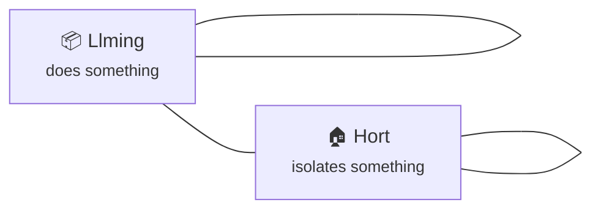

| Concept | What it is | What it provides |
|---------|-----------|-----------------|
| **Llming** | The universal building block | MCP tools, SOUL (knowledge), broadcasts, circuit elements |
| **Hort** | The universal isolation boundary | Container, network rules, credentials, sub-horts |

There are no other types. No "connectors", "raw MCPs", "tools", or "services" as separate concepts:

- Telegram? It's a llming (`openhort/telegram`)
- Office 365? It's a llming (`microsoft/office365`)
- Filesystem access? It's a llming (`openhort/filesystem`)
- Shell/CURL? It's a llming (`openhort/shell`)
- A third-party MCP server? Must be wrapped in a llming
- A Docker container? It's a hort
- A remote VM? It's a hort
- A cloud service? It's a hort with llmings inside

## The Root Hort

The system always starts with a root hort. There is no way around this — every OpenHORT instance IS a hort:

```yaml
hort:
  name: "My Desktop"
  agent: { provider: claude-code, model: claude-sonnet-4-6 }
  container: { memory: 4g, cpus: 4, network: [api.anthropic.com] }

  llmings:
    - openhort/telegram: { token: env:TELEGRAM_BOT_TOKEN }
    - openhort/filesystem: { paths: { /workspace: rw } }
    - openhort/shell: {}
    - openhort/github: {}
```

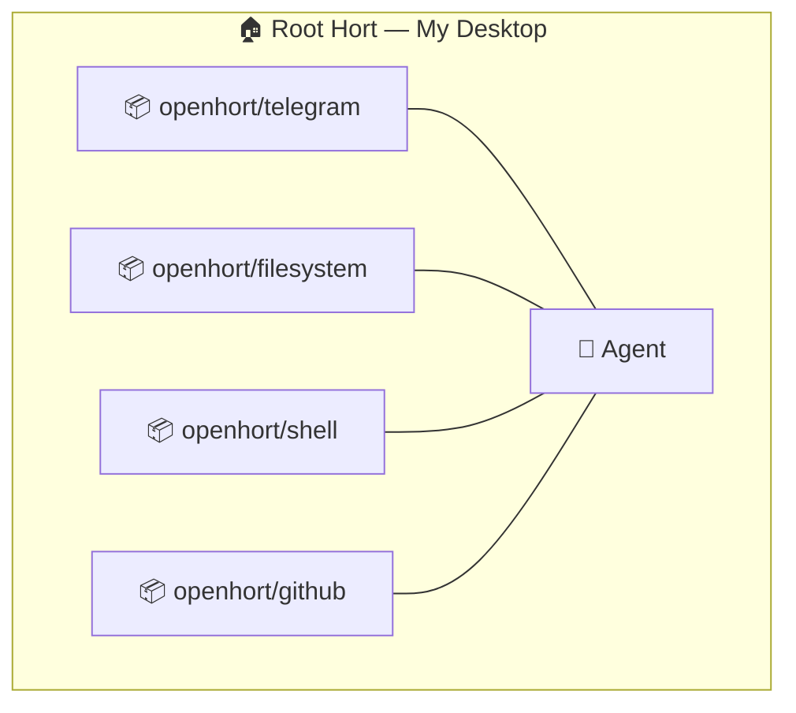

## Sub-Horts

A hort can contain other horts. Sub-horts provide isolation — their own container, network, credentials:

```yaml
hort:
  name: "My Desktop"
  agent: { provider: claude-code, model: claude-sonnet-4-6 }
  container: { memory: 4g, cpus: 4, network: [api.anthropic.com] }

  llmings:
    - openhort/telegram: {}
    - openhort/shell: {}
    - hort/o365: { taint: source:o365, block_taint: [source:sap] }
    - hort/sap: { taint: source:sap, block_taint: [source:o365] }

hort/o365:
  container:
    network: [graph.microsoft.com, login.microsoftonline.com]
  credentials:
    AZURE_CLIENT_ID: vault:azure/client-id
    AZURE_CLIENT_SECRET: vault:azure/client-secret
  llmings:
    - microsoft/office365:
        allow: [read_*, search_*, list_*]
        deny:  [send_*, delete_*, write_*]

hort/sap:
  container:
    network: [sap.internal:8443]
  credentials:
    SAP_USER: vault:sap/user
    SAP_PASS: vault:sap/password
  llmings:
    - sap/connector:
        allow: [get_*, search_*]
        deny:  [write_*, approve_*]
```

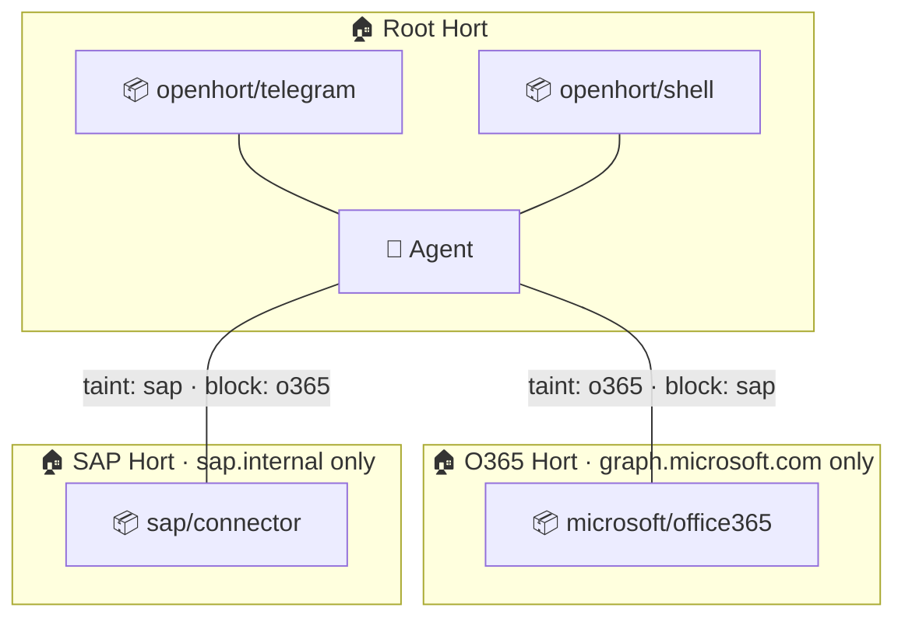

Sub-horts can be:

- **Docker containers** — local isolation with network/credential boundaries
- **Virtual machines** — stronger isolation (separate kernel)
- **Remote machines** — physical separation (Raspberry Pi, cloud VM)

## Remote Horts

A remote hort is a hort on another machine, connected via H2H tunnel or WireGuard:

```yaml
hort:
  name: "My Desktop"
  llmings:
    - openhort/telegram: {}
    - hort/pi-kitchen: { taint: source:iot }
    - hort/cloud-worker: {}

hort/pi-kitchen:
  remote:
    host: 10.0.1.50
    port: 8940
    key: vault:cluster/pi-kitchen
  trust: sandboxed
  budget: { max_usd: 2.00 }
  llmings:
    - homeassistant/integration:
        allow: [get_state, list_entities]
        deny:  [call_service]

hort/cloud-worker:
  remote:
    host: worker.eastus.azure.com
    port: 8940
    key: vault:cluster/cloud-worker
    via: wireguard
  trust: untrusted
  llmings:
    - openhort/code-runner: {}
```

## Three Wiring Forms

There are exactly three ways to wire things together. Each has different visibility rules.

### Form 1: Llming-to-Hort (Standard)

A llming plugged into a hort. The agent inside the hort can use the llming's tools. This is the default — every llming listed under a hort's `llmings:` section is wired this way.

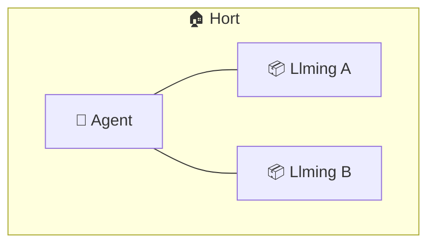

**Visibility**: The agent sees all llmings in its hort. Each llming sees only the agent (not other llmings). Rules on each wire control what the agent can do with that llming.

```yaml
hort:
  llmings:
    - openhort/github: { allow_groups: [read-only] }
    - openhort/shell: { allow_groups: [read-only] }
```

### Form 2: Hort-to-Hort (Boundary)

One hort connected to another. The parent hort's agent can reach through and use all llmings inside the child hort. The child hort provides isolation — its own container, network, credentials.

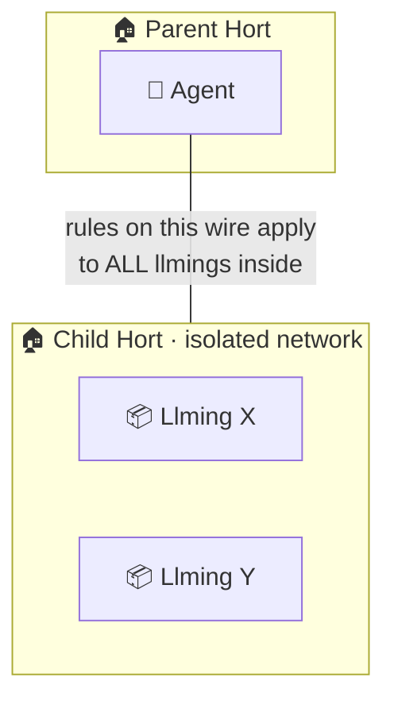

**Visibility**: The parent's agent sees all llmings inside the child hort. Rules on the hort-to-hort wire apply as a **blanket** to everything flowing in and out. Individual llmings inside the child can have their own additional rules.

```yaml
hort:
  llmings:
    - hort/o365:                       # wire to the child hort
        taint: source:o365             # blanket: everything coming back is tagged
        block_taint: [source:sap]      # blanket: SAP data can never go in

hort/o365:
  container:
    network: [graph.microsoft.com]
  llmings:
    - microsoft/office365:             # individual rules inside the child
        allow_groups: [read-only]
        deny_groups: [outbound, destructive]
```

!!! info "Blanket + individual = intersection"
    The hort-to-hort wire rules are the **outer boundary**. Individual llming rules inside the child are the **inner boundary**. Both must allow a tool call for it to proceed. The effective permission is the intersection — the most restrictive of both.

### Form 3: Llming-to-Llming (Direct)

Two llmings wired directly to each other, bypassing the agent entirely. They see **only each other** — not the rest of the hort.

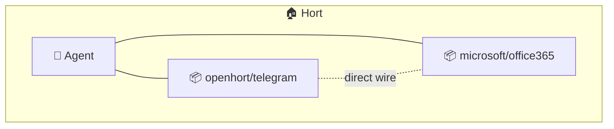

**Visibility**: Through the direct wire, Telegram sees only Office 365's broadcasts (and vice versa). Neither sees the agent or any other llming through this wire.

**Use case**: Circuit triggers. "Email arrived" fires directly from Office 365 to Telegram without involving the LLM. Event-driven, not agent-driven.

```yaml
hort:
  llmings:
    - openhort/telegram: {}
    - microsoft/office365: {}

  direct:
    - between: [openhort/telegram, microsoft/office365]
      allow: [email_arrived, calendar_reminder]
```

### Rule Precedence

When multiple wiring forms coexist, rules stack:

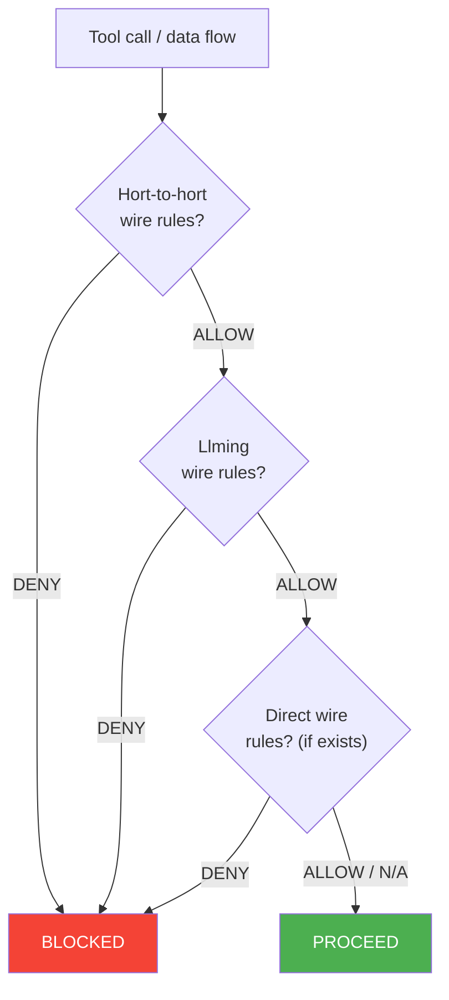

1. **Hort-to-hort wire** — the outer blanket. Cannot be overridden by inner rules.
2. **Llming wire** — per-llming rules inside the hort. Further restricts.
3. **Direct wire** — if two llmings have a direct connection, those rules apply additionally. Direct wires can open paths that aren't available through the agent (like broadcast events) but **cannot bypass** hort-level restrictions.

!!! danger "Direct wires cannot weaken hort rules"
    A direct wire between two llmings can allow broadcasts and circuit triggers that don't go through the agent. But if the hort-to-hort wire says `deny: [send_*]`, the direct wire cannot override that with `allow: [send_email]`. Hort rules are the ceiling.

### Summary

| Form | Visual | What sees what | Rules apply to |
|------|--------|---------------|----------------|
| Llming-to-hort | `📦 — 🏠` | Agent sees llming | That llming's tools |
| Hort-to-hort | `🏠 — 🏠` | Parent agent sees all child llmings | Everything in/out of child |
| Llming-to-llming | `📦 ··· 📦` | Two llmings see only each other | Only the direct connection |

## Groups & Fast Permission Assignment

Fine-grained YAML is powerful but tedious. A user shouldn't need to know that `microsoft/office365` provides 47 tools and manually classify each one. **Groups** solve this.

### How Groups Work

A group is a named bag of tool patterns. The system ships with four built-in groups based on verb analysis:

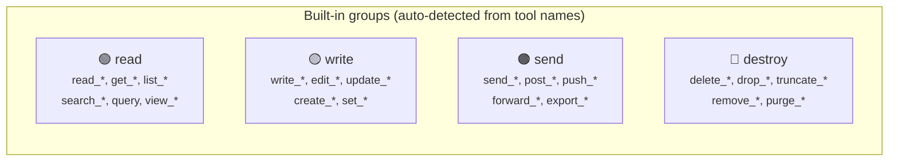

When a llming like `microsoft/office365` is loaded, the system reads its MCP tool list and **auto-assigns every tool to a group** based on its name:

| Tool from `microsoft/office365` | Auto-assigned group |
|------|-------|
| `read_email` | 🟢 read |
| `search_email` | 🟢 read |
| `list_calendars` | 🟢 read |
| `get_attachment` | 🟢 read |
| `create_event` | 🟡 write |
| `update_event` | 🟡 write |
| `send_email` | 🟠 send |
| `forward_email` | 🟠 send |
| `delete_email` | 🔴 destroy |

The user never types tool names. They see color-coded groups and check boxes.

### Llming-Declared Groups

Llming authors can declare their own groups in `extension.json`, overriding auto-detection:

```json
{
  "name": "office365",
  "author": "microsoft",
  "groups": {
    "read-only": {
      "tools": ["read_email", "search_email", "list_calendars",
                "get_attachment", "get_contact"],
      "color": "green",
      "description": "View emails, calendar, contacts"
    },
    "compose": {
      "tools": ["create_draft", "create_event", "update_event"],
      "color": "yellow",
      "description": "Create and edit — requires manual send"
    },
    "deliver": {
      "tools": ["send_email", "forward_email", "send_invite"],
      "color": "orange",
      "description": "Send externally — data leaves the system"
    },
    "admin": {
      "tools": ["delete_email", "purge_folder", "set_rules"],
      "color": "red",
      "description": "Destructive and admin operations"
    }
  }
}
```

When a llming declares its own groups, those take precedence over auto-detection. The user sees the llming author's curated grouping instead of raw verb matching.

### Using Groups on Wires

Instead of listing tools, reference groups on the wire:

=== "With groups (what users actually write)"

    ```yaml
    hort:
      llmings:
        - microsoft/office365:
            allow_groups: [read-only, compose]
            deny_groups:  [deliver, admin]
    ```

=== "Without groups (equivalent, but tedious)"

    ```yaml
    hort:
      llmings:
        - microsoft/office365:
            allow: [read_email, search_email, list_calendars,
                    get_attachment, get_contact, create_draft,
                    create_event, update_event]
            deny:  [send_email, forward_email, send_invite,
                    delete_email, purge_folder, set_rules]
    ```

### Custom Groups

Users can create their own groups that compose built-in or llming-declared groups:

```yaml
groups:
  safe:
    description: "Safe for autonomous use"
    include_groups: [read]
    add: [create_draft, create_event]    # manually include specific tools
    color: green

  full:
    description: "Full access for interactive use"
    include_groups: [read, write, send]
    deny_groups: [destroy]
    color: yellow

  autonomous:
    description: "What the background agent can use"
    include_groups: [safe]
    remove: [get_attachment]             # exclude specific tools
    color: blue
```

Group composition rules:

- `include_groups` — start with all tools from these groups
- `add` — manually add specific tool names
- `remove` — manually remove specific tool names
- `deny_groups` — explicitly exclude all tools in these groups

### Assigning Groups to Contexts

The primary use: assign different group sets to different access contexts.

```yaml
hort:
  llmings:
    - openhort/telegram:
        groups: [full]                   # interactive user gets full access

    - agent/background-worker:
        groups: [autonomous]             # background agent gets safe subset
        container: { memory: 2g, network: [api.anthropic.com] }
```

One llming, two consumers, different permissions — defined by group assignment.

## Visual Editor UX

The visual editor renders the YAML as a canvas. The goal: **five interactions** from "I want Office 365" to "it's configured and safe".

### Step 1: Drop a llming

User drags `microsoft/office365` from the llming catalog onto the canvas. The system auto-creates a hull (sub-hort) because the llming's manifest says `isolation: recommended`:

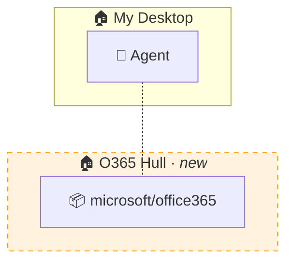

The wire is dotted — not yet configured.

### Step 2: Draw a cable

User clicks the agent, drags to the O365 hull. A solid wire appears. The **permission panel** opens automatically:

```
┌─────────────────────────────────────────────────────┐
│  Wire: Agent ↔ microsoft/office365                  │
│                                                     │
│  Groups:                                            │
│  ┌──────────────────────────────────────┐           │
│  │ [x] 🟢 read-only                    │           │
│  │     View emails, calendar, contacts  │           │
│  │ [x] 🟡 compose                      │           │
│  │     Create and edit drafts           │           │
│  │ [ ] 🟠 deliver                      │           │
│  │     Send externally                  │           │
│  │ [ ] 🔴 admin                        │           │
│  │     Destructive operations           │           │
│  └──────────────────────────────────────┘           │
│                                                     │
│  Taint: [x] Tag as source:o365                      │
│  Block: [x] source:sap  [ ] source:hr              │
│                                                     │
│  [ Advanced: filters, custom allow/deny ]           │
│                                                     │
│  [Apply]                                            │
└─────────────────────────────────────────────────────┘
```

### Step 3: Check boxes

User checks `read-only` and `compose`. Leaves `deliver` and `admin` unchecked. Two clicks.

### Step 4: Set taint (optional)

The system suggests taint based on the llming's category. User confirms with one click.

### Step 5: Done

Wire turns solid. Color-coded badges appear on the wire showing which groups are active:

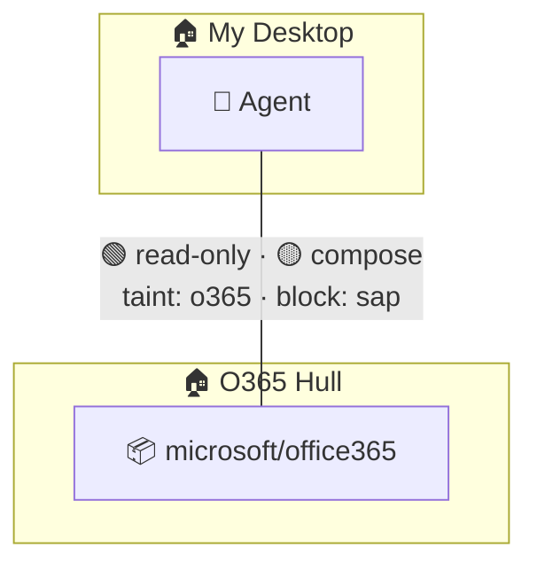

### Smart Defaults

The permission panel pre-selects groups based on the **access context**:

| Context | Pre-selected | Rationale |
|---------|-------------|-----------|
| Interactive user (Telegram, web) | 🟢 read + 🟡 write | User is present, can review before send |
| Autonomous agent | 🟢 read only | No human in the loop |
| Admin user (local terminal) | All groups | Full trust |
| Remote viewer (cloud) | 🟢 read only | Untrusted network |

The user can always change these, but the defaults mean most setups require zero manual group selection.

### Bulk Assignment

When connecting a hort with many llmings, the permission panel shows a **bulk view**:

```
┌─────────────────────────────────────────────────────────────────────┐
│  Wire: Telegram ↔ Agent (applies to all llmings in this hort)      │
│                                                                     │
│  Quick presets:                                                     │
│  (•) Safe — read-only for all llmings                              │
│  ( ) Standard — read + write, no send/destroy                      │
│  ( ) Full — everything except destroy                              │
│  ( ) Custom — configure per llming                                 │
│                                                                     │
│  Per-llming overrides (expand to customize):                       │
│  ▸ microsoft/office365    🟢 read · 🟡 compose                    │
│  ▸ sap/connector          🟢 read                                  │
│  ▸ openhort/shell          🟢 read                                  │
│  ▸ openhort/filesystem    🟢 read · 🟡 write                      │
│                                                                     │
│  [Apply to all]                                                     │
└─────────────────────────────────────────────────────────────────────┘
```

One click on "Safe" configures every llming in the hort to read-only. Then expand individual llmings to grant extra permissions where needed.

### Visual Feedback

The canvas uses color to show the security posture at a glance:

| Wire color | Meaning |
|-----------|---------|
| Green solid | Read-only — safe |
| Yellow solid | Read + write — moderate |
| Orange solid | Includes send/outbound — data can leave |
| Red solid | Includes destructive or unrestricted |
| Dotted gray | Not yet configured |
| Red dashed | Policy violation detected |

Taint flow is visualized by **background shading** — if a llming produces tainted data, the hort's background tints to match:

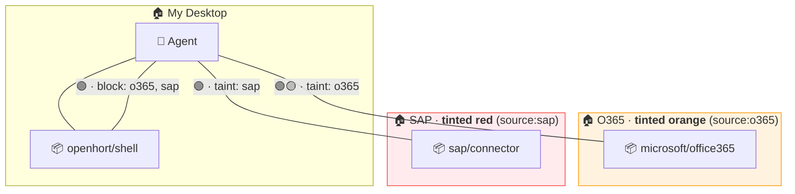

At a glance: O365 produces orange-tainted data, SAP produces red-tainted data, and the shell wire blocks both taints from leaking out. The visual makes it obvious what's wired and what can flow where.

## Auto-Assigned Tool Table

When `microsoft/office365` provides tools `read_email`, `send_email`, `delete_email`, `search_email`, `list_calendars`, `create_event` — they're auto-assigned:

| Tool | Group | Color |
|------|-------|-------|
| `read_email` | read | green |
| `search_email` | read | green |
| `list_calendars` | read | green |
| `create_event` | write | yellow |
| `send_email` | send | orange |
| `delete_email` | destroy | red |

## Filters on Connections

Any connection (hort-to-hort, llming-to-hort, or direct llming-to-llming) can have filters attached. Filters inspect the actual data flowing through, not just tool names:

```yaml
hort:
  llmings:
    - hort/sap:
        allow_groups: [read]
        taint: source:sap
        filters:
          - pii: { redact: ['\d{3}-\d{2}-\d{4}'] }
          - keywords: { deny: ["RESTRICTED", "CONFIDENTIAL"] }

    - openhort/shell:
        allow_groups: [read]
        filters:
          - urls: { allow: [github.com, pypi.org], deny: ["*"] }
          - taint_block: [source:sap, source:o365]
```

Filters target specific layers of the llming:

| Filter target | What it inspects | Example |
|---------------|-----------------|---------|
| **mcp** | Tool call arguments and results | SQL injection guard, PII redactor |
| **tool** | Shell commands, file paths | URL allowlist, path restrictions |
| **broadcast** | Events emitted by the llming | Sensitivity-based event filtering |
| **soul** | System prompt fragments | Prompt injection detection |

```yaml
filters:
  - type: mcp
    on: outbound                       # tool results coming back
    redact: ['\b\d{3}-\d{2}-\d{4}\b'] # SSN patterns

  - type: tool
    on: inbound                        # commands being sent
    urls: { allow: [github.com] }

  - type: broadcast
    on: outbound                       # events being emitted
    max_sensitivity: internal          # block confidential+ events
```

## Complete Example

A complete `openhort.yaml` for a real-world setup:

```yaml
# ── Groups (reusable across all connections) ───────────────

groups:
  read-only:
    auto: [read_*, get_*, list_*, search_*, query, glob, grep]
    color: green

  standard:
    include_groups: [read-only]
    auto: [create_*, update_*, edit_*, write_*]
    color: yellow

  outbound:
    auto: [send_*, post_*, push_*, forward_*, export_*]
    color: orange

  destructive:
    auto: [delete_*, drop_*, truncate_*, remove_*]
    color: red

  code-safe:
    include_groups: [read-only]
    add: [create_pr, push, edit_file, write_file]
    color: green

# ── Root Hort ──────────────────────────────────────────────

hort:
  name: "My Desktop"
  agent: { provider: claude-code, model: claude-sonnet-4-6 }
  container: { memory: 4g, cpus: 4, network: [api.anthropic.com] }

  llmings:
    - openhort/telegram:
        token: env:TELEGRAM_BOT_TOKEN
        allowed_users: [michael_dev]

    - openhort/lan-viewer:
        port: 8940

    - openhort/cloud-access:
        server: https://openhort-access.azurewebsites.net
        key: vault:cloud/key

    - openhort/github:
        allow_groups: [code-safe]
        deny_groups:  [destructive]

    - openhort/filesystem:
        paths:
          /workspace/src:     rw
          /workspace/docs:    rw
          /workspace/config:  ro
          /workspace/secrets: none

    - openhort/shell:
        allow_groups: [read-only]
        filters:
          - urls: { allow: [github.com, pypi.org, api.weather.com] }
          - taint_block: [source:o365, source:sap, source:hr]

    - hort/o365:
        taint: source:o365
        block_taint: [source:sap, source:hr]

    - hort/sap:
        taint: source:sap
        block_taint: [source:o365]

    - hort/hr:
        taint: [source:hr, content:pii]
        block_taint: [source:o365, source:sap]

    - hort/pi-kitchen:
        taint: source:iot

  direct:
    - between: [openhort/telegram, microsoft/office365]
      allow: [email_arrived, calendar_reminder]

  circuits:
    - on: microsoft/office365::email_arrived
      filter: { from: "*@mycompany.com", subject: "*urgent*" }
      do: openhort/telegram::send
      message: "Urgent: {{subject}} from {{from}}"

    - on: homeassistant/integration::sensor_changed
      filter: { entity: "binary_sensor.front_door", state: "on" }
      do: openhort/telegram::send
      message: "Front door opened"

# ── Sub-Horts ──────────────────────────────────────────────

hort/o365:
  container:
    network: [graph.microsoft.com, login.microsoftonline.com]
  credentials:
    AZURE_CLIENT_ID: vault:azure/client-id
    AZURE_CLIENT_SECRET: vault:azure/client-secret
  llmings:
    - microsoft/office365:
        allow_groups: [read-only]
        deny_groups:  [outbound, destructive]

hort/sap:
  container:
    network: [sap.internal:8443]
  credentials:
    SAP_USER: vault:sap/user
    SAP_PASS: vault:sap/password
  llmings:
    - sap/connector:
        allow_groups: [read-only]
        deny_groups:  [standard, outbound, destructive]
        filters:
          - sql: { deny: [DROP, DELETE, TRUNCATE] }

hort/hr:
  container:
    network: [postgres.internal:5432]
  credentials:
    PG_URI: vault:hr/connection-string
  llmings:
    - openhort/postgres:
        allow_groups: [read-only]
        filters:
          - pii: { redact: ['\d{3}-\d{2}-\d{4}'] }

hort/pi-kitchen:
  remote:
    host: 10.0.1.50
    port: 8940
    key: vault:cluster/pi-kitchen
  trust: sandboxed
  budget: { max_usd: 2.00 }
  llmings:
    - homeassistant/integration:
        allow_groups: [read-only]
        deny_groups:  [standard, outbound, destructive]
```

## Visual Editor

The visual editor renders this YAML as a canvas:

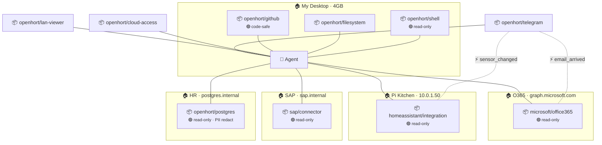

Clicking a cable shows its rules with group badges. Clicking a hort shows its container/network/credentials. Dragging a new llming onto the canvas auto-creates a hull if the llming's manifest recommends isolation.

Five clicks to set up a new connection:

1. Drag llming onto canvas
2. Draw cable to agent
3. Pick groups: `[x] read-only  [ ] standard  [ ] outbound  [ ] destructive`
4. (Optional) Add taint label
5. Done
