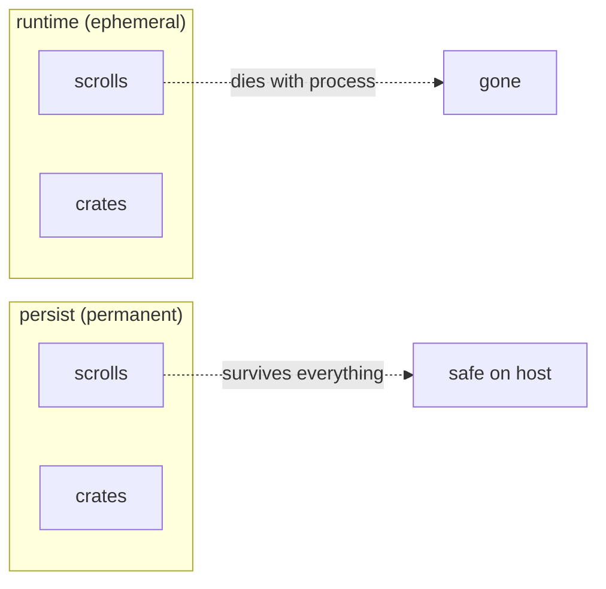

# Storage

Every llming gets isolated storage with two lifetimes and three
access levels. All data goes through this system — no direct
filesystem access, no ad-hoc JSON files, no custom stores.

## Three Data Systems

| System | Purpose | API style | Example |
|--------|---------|-----------|---------|
| **Scrolls** | Structured data (JSON) | MongoDB-compatible | Circuits, configs, metrics history |
| **Crates** | Binary files | Azure Blob-compatible | Screenshots, exports, model weights |
| **Pulses** | Live state + events | Pub/sub | CPU usage, camera status, active windows |

Scrolls and crates are stored. Pulses are ephemeral (in-memory,
never persisted). All three follow the same access level rules.

## Two Lifetimes



| Lifetime | Where | Survives restart | Use for |
|----------|-------|-----------------|---------|
| **runtime** | Local to process/container | No | Caches, session state, temp files |
| **persist** | Host filesystem | Yes | Circuits, user configs, history, exports |

Both expose the same API. A llming in a short-lived container writes
to `persist` and the data is safe on the host forever.

## Three Access Levels

Every scroll, crate, and pulse has an access level:

| Level | Who can read | Who can write | Example |
|-------|-------------|---------------|---------|
| **private** | Only the owning llming | Only the owning llming | API keys, credentials, internal state |
| **shared** | Llmings with permission (via wire rules) | Only the owning llming | Process list, email summaries, camera frames |
| **public** | Any llming, any viewer | Only the owning llming | CPU usage, uptime, camera count, disk space |

Access levels map to the existing taint system:

| Access level | Taint zone | Flow policy |
|-------------|------------|-------------|
| private | `restricted` | Blocked at all boundaries |
| shared | `internal` / `confidential` | Allowed within permitted groups |
| public | `public` | Allowed everywhere |

### Declaring Access Levels

Llmings declare access levels when storing data:

```python
# Private — only this llming can read
await self.persist.scrolls.insert("credentials",
    {"token": "sk-ant-..."}, access="private")

# Shared — permitted llmings can read (wire rules decide who)
await self.persist.scrolls.insert("emails",
    {"subject": "Meeting"}, access="shared")

# Public — anyone can read
await self.persist.scrolls.insert("metrics",
    {"cpu": 42.5}, access="public")
```

For crates:
```python
await self.persist.crates.put("exports", "screenshot.png",
    png_bytes, access="public", ttl=3600)
```

For pulses:
```python
self.pulse.emit("cpu_load", {"value": 42.5}, access="public")
self.pulse.emit("process_list", {"procs": [...]}, access="shared")
```

### Reading Across Llmings

A llming can read another llming's data only if:

1. The data is `public`, OR
2. The data is `shared` AND the wire rules permit it

```python
# Read public data from any llming
cpu = await self.read_shared("system-monitor", "metrics", {"key": "cpu"})

# Read shared data (only works if wire permits)
emails = await self.read_shared("office365", "emails", {"unread": True})

# This fails — private data
creds = await self.read_shared("office365", "credentials")  # → PermissionError
```

The router enforces access levels. The llming never sees data it's not
allowed to see.

### Transparency

Every cross-llming data access is logged:

```json
{"ts": 1775900000, "from": "hort-chief", "to": "system-monitor",
 "collection": "metrics", "access": "public", "action": "read"}
{"ts": 1775900001, "from": "telegram", "to": "office365",
 "collection": "emails", "access": "shared", "action": "read",
 "wire_rule": "mail-group:reads"}
```

Admins can see all data flows via `/flows` command or the audit log.

## Scroll API (MongoDB-compatible)

```python
# Insert
doc_id = await self.persist.scrolls.insert("circuits",
    {"name": "my-flow", "nodes": [...]}, ttl=None, access="private")

# Find
flow = await self.persist.scrolls.find_one("circuits", {"name": "my-flow"})
all_flows = await self.persist.scrolls.find("circuits", {"active": True},
    sort=[("created", -1)], limit=10)

# Update
await self.persist.scrolls.update_one("circuits",
    {"_id": flow_id}, {"$set": {"active": False}})
await self.persist.scrolls.update_one("counters",
    {"_id": "visits"}, {"$inc": {"count": 1}})

# Delete
await self.persist.scrolls.delete_one("circuits", {"_id": flow_id})
await self.persist.scrolls.delete_many("cache", {"stale": True})

# Count
n = await self.persist.scrolls.count("circuits", {"active": True})
```

### Supported Query Operators

| Operator | Example | Description |
|----------|---------|-------------|
| `$gt`, `$gte` | `{"age": {"$gt": 18}}` | Greater than |
| `$lt`, `$lte` | `{"age": {"$lt": 65}}` | Less than |
| `$ne` | `{"status": {"$ne": "deleted"}}` | Not equal |
| `$in` | `{"tag": {"$in": ["a", "b"]}}` | In list |
| `$exists` | `{"email": {"$exists": True}}` | Field exists |
| `$and` | `{"$and": [{...}, {...}]}` | Logical AND |
| `$or` | `{"$or": [{...}, {...}]}` | Logical OR |

### Supported Update Operators

| Operator | Example | Description |
|----------|---------|-------------|
| `$set` | `{"$set": {"name": "new"}}` | Set fields |
| `$unset` | `{"$unset": {"old": ""}}` | Remove fields |
| `$inc` | `{"$inc": {"count": 1}}` | Increment |
| `$push` | `{"$push": {"tags": "new"}}` | Append to array |

## Crate API (Azure Blob-compatible)

```python
# Upload
info = await self.persist.crates.put("exports", "report.pdf",
    pdf_bytes, content_type="application/pdf",
    metadata={"author": "system"}, ttl=86400, access="shared")

# Download
data, info = await self.persist.crates.get("exports", "report.pdf")

# Metadata only
info = await self.persist.crates.head("exports", "report.pdf")
# info.size, info.content_type, info.created_at, info.expires_at, info.metadata

# List
blobs = await self.persist.crates.list("exports", prefix="report")

# Delete
await self.persist.crates.delete("exports", "report.pdf")

# Check existence
exists = await self.persist.crates.exists("exports", "report.pdf")
```

## TTL and Garbage Collection

Every scroll and crate can have a TTL (time-to-live in seconds):

```python
# Expires in 5 minutes
await self.runtime.scrolls.insert("cache", {"key": "temp"}, ttl=300)

# Expires in 1 hour
await self.runtime.crates.put("tmp", "frame.webp", data, ttl=3600)
```

Expired data is:
- Invisible to queries immediately
- Removed from disk by the garbage collector (runs every 60 seconds)
- Logged when removed (for debugging)

No TTL = permanent (until explicitly deleted or runtime store dies).

## Storage Layout

```
~/.hort/storage/
    system-monitor/
        docs.db             # persist scrolls (SQLite)
        blobs/              # persist crates (files + metadata.db)
    telegram-connector/
        docs.db
        blobs/
    llming-cam/
        docs.db
        blobs/

~/.hort/runtime/
    system-monitor/
        docs.db             # runtime scrolls (ephemeral)
        blobs/              # runtime crates (ephemeral)
```

Each llming gets its own SQLite database. No cross-llming file access.

## Implementation

```
hort/storage/
    __init__.py             # Storage, StorageManager exports
    store.py                # Storage class (runtime + persist namespaces)
    scrolls/
        __init__.py         # ScrollStore (MongoDB-compatible, SQLite-backed)
    crates/
        __init__.py         # CrateStore (Azure Blob-compatible, filesystem-backed)
    pulses/
        __init__.py         # PulseBus (live state + events, in-memory)
```
