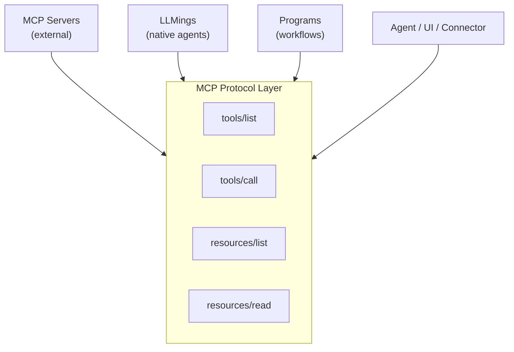
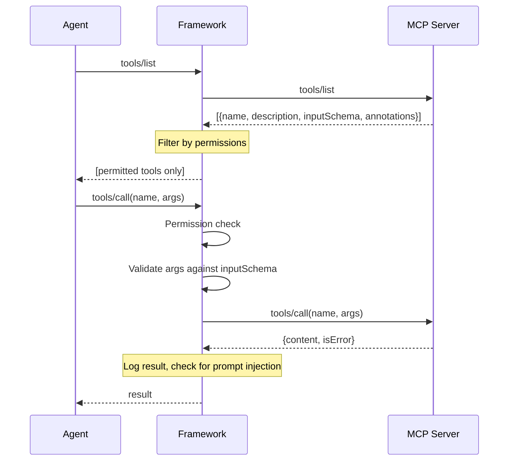
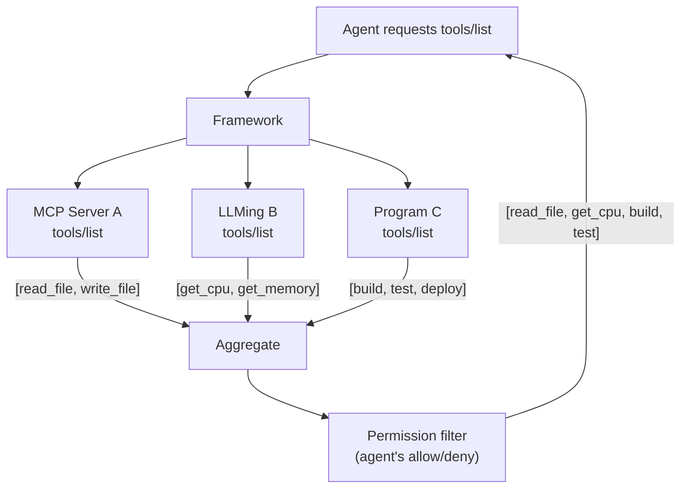
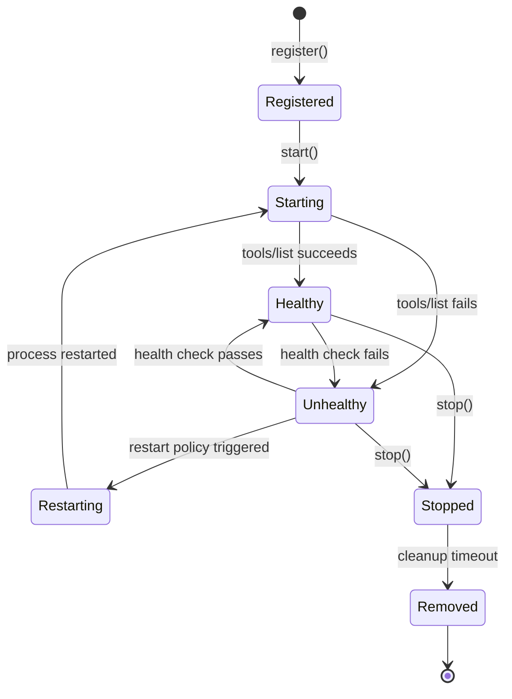
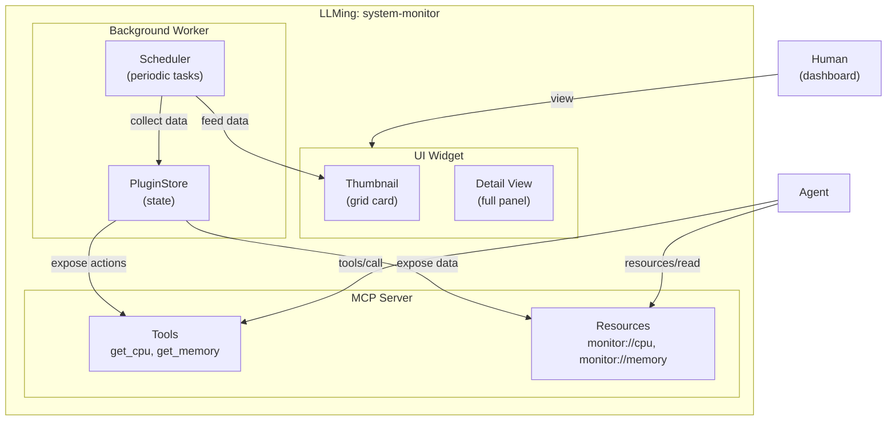
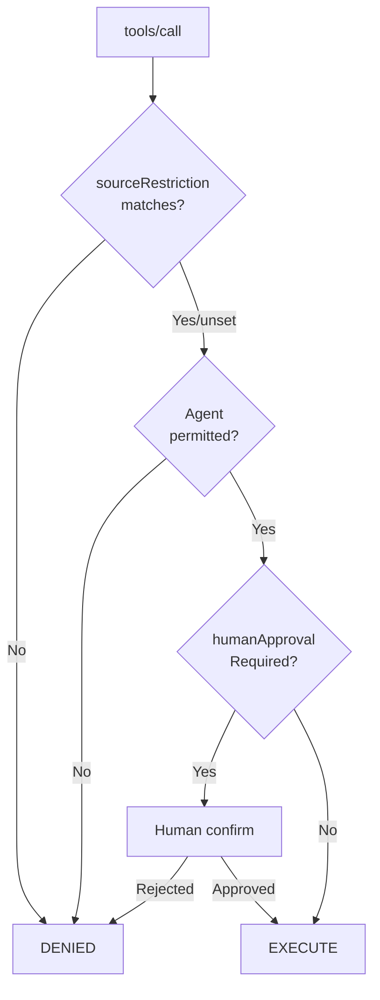
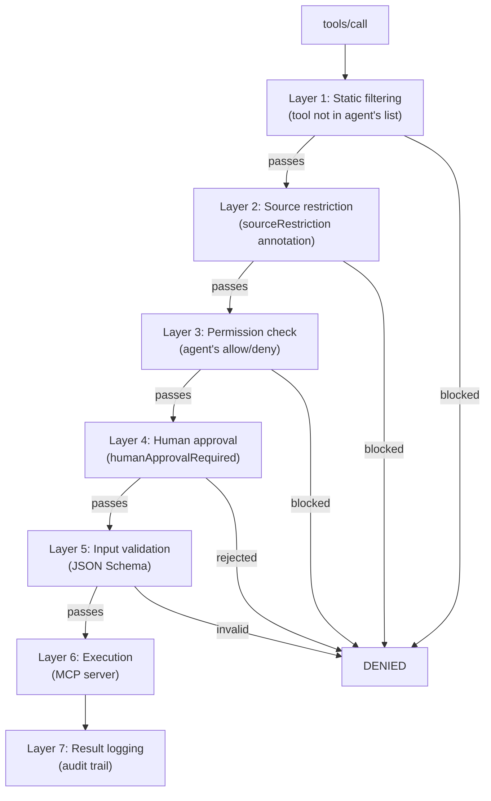

# Unified Tool System

Everything in OpenHORT that does work is a tool. Every tool speaks
MCP. This single design decision eliminates protocol translation,
simplifies permissions, and makes every capability -- whether native,
external, or composed -- discoverable and callable through one interface.

## Tool Types

OpenHORT recognizes three tool types. All expose capabilities via
MCP, so consumers never need to know which kind they are talking to.



### MCP Servers

Standard Model Context Protocol servers from the ecosystem.

| Property | Detail |
|----------|--------|
| Examples | Filesystem, database, calendar, washing machine |
| Transport | stdio (local process), SSE or streamable HTTP (remote) |
| Discovery | Configured in `hort.yaml` or detected via mDNS |
| Lifecycle | OpenHORT starts, stops, and health-checks the process |
| Trust | Ranges from fully trusted (first-party) to untrusted (community) |

OpenHORT treats it as a black box -- it only cares about `tools/list`,
`tools/call`, `resources/list`, and `resources/read`.

### LLMings

OpenHORT's native agents and data collectors. Each LLMing IS an MCP
server, plus a UI component and a background worker.

| Property | Detail |
|----------|--------|
| Examples | System monitor, clipboard manager, network scanner |
| Transport | In-process (direct Python calls, exposed as MCP) |
| Discovery | Registered at plugin activation time |
| Lifecycle | Managed by the plugin system (activate/deactivate) |
| Trust | First-party, runs in the Hort process |

See [LLMing Architecture](#llming-architecture) for the detailed
three-component breakdown.

### Programs

Defined sequences of actions -- build steps, deployment pipelines,
data processing chains. Each step is exposed as an MCP tool.

| Property | Detail |
|----------|--------|
| Examples | Deploy pipeline, backup routine, data ETL |
| Transport | In-process (steps execute locally or in containers) |
| Discovery | Registered from program definitions in config |
| Lifecycle | Created on definition, steps callable on demand |
| Trust | Defined by the Hort owner, trusted |

```yaml title="programs/deploy.yaml"
name: deploy
steps:
  - name: build
    command: "python -m build"
    annotations: {destructiveHint: false}
  - name: test
    command: "pytest tests/"
    annotations: {readOnlyHint: true}
  - name: push
    command: "docker push registry/app:latest"
    annotations: {destructiveHint: true, openWorldHint: true}
  - name: verify
    command: "curl -f https://app.example.com/health"
    annotations: {readOnlyHint: true, openWorldHint: true}
```

Each step appears as an MCP tool: `deploy:build`, `deploy:test`,
`deploy:push`, `deploy:verify`. Agents or schedulers can call
individual steps or trigger the full sequence.

## The MCP Foundation

### Why Everything is MCP

| Without MCP unification | With MCP unification |
|------------------------|---------------------|
| N protocols for N tool types | 1 protocol for all tool types |
| Permission engine understands each protocol | Permission engine understands MCP |
| Agents need adapters per tool type | Agents call `tools/call` uniformly |
| Cross-Hort sharing requires protocol bridges | Cross-Hort sharing is MCP over the wire |
| Discovery varies per tool type | `tools/list` everywhere |

An agent does not need to know whether a tool is a native LLMing,
an external MCP server, or a program step. The interface is identical.

### Protocol Summary

MCP uses JSON-RPC 2.0. The methods relevant to the tool system:

| Method | Direction | Purpose |
|--------|-----------|---------|
| `initialize` | client to server | Handshake, capability negotiation |
| `tools/list` | client to server | Discover available tools with JSON Schema inputs |
| `tools/call` | client to server | Execute a tool with validated arguments |
| `resources/list` | client to server | Discover available data sources |
| `resources/read` | client to server | Read data from a named resource |
| `notifications/tools/list_changed` | server to client | Tool set has changed, re-fetch |



### Tool Definition Format

Every tool is described by the same schema -- name, description,
JSON Schema for inputs, and annotations for the permission engine:

```json
{
  "name": "get_status",
  "description": "Returns the current machine status",
  "inputSchema": {
    "type": "object",
    "properties": {
      "verbose": {"type": "boolean", "description": "Include detailed diagnostics"}
    }
  },
  "annotations": {
    "readOnlyHint": true, "destructiveHint": false,
    "idempotentHint": true, "openWorldHint": false
  }
}
```

## Tool Registration

Tools enter the registry through three paths: **static** (defined
in `hort.yaml` or agent config), **dynamic** (LLMings register at
activation, programs register at load), and **external** (mDNS
discovery or Hort-to-Hort import).

### Registration Record

Each registered tool carries metadata beyond the MCP tool definition:

| Field | Type | Description |
|-------|------|-------------|
| `name` | string | Globally unique within the Hort (namespaced as `server:tool`) |
| `tool_type` | enum | `mcp`, `llming`, `program` |
| `transport` | enum | `stdio`, `sse`, `http`, `in-process` |
| `server_name` | string | The MCP server this tool belongs to |
| `input_schema` | object | JSON Schema for tool arguments |
| `annotations` | object | MCP annotations (readOnlyHint, destructiveHint, etc.) |
| `health` | enum | `healthy`, `unhealthy`, `unknown` |
| `registered_at` | datetime | When the tool was registered |

### Namespace Rules

Tool names are scoped to their MCP server: `<server-name>:<tool-name>`.
For example: `filesystem:read_file`, `system-monitor:get_cpu`,
`deploy:build`, `washer:start_cycle`. The framework routes calls to
the correct server and strips the prefix before forwarding.

!!! warning "Name collision resolution"
    If two MCP servers register a tool with the same namespaced name,
    the second registration is rejected. Rename one of the servers in
    `hort.yaml` to resolve the conflict.

## Tool Discovery

| Scope | How it works |
|-------|-------------|
| **Within a Hort** | Framework aggregates `tools/list` from all registered servers, filters by agent permissions, returns the union. |
| **From parent Hort** | Parent exports tools to children. They appear in the child's `tools/list` as local, calls proxied to parent. |
| **From remote Hort (H2H)** | Imported tools appear with an `h2h:` prefix. Transparent proxy layer handles routing. |



!!! info "Static filtering"
    Agents only see tools they are permitted to use. The framework
    removes disallowed tools from `tools/list` responses before the
    agent sees them. The agent cannot reason about tools it does not
    know exist.

## Tool Lifecycle

Every tool moves through a defined set of states.



### Health Checks

The framework periodically verifies each MCP server is responsive:

| Check | Method | Interval |
|-------|--------|----------|
| Liveness | `tools/list` call with 5s timeout | 30 seconds |
| Process | Check PID is alive (stdio transport) | 10 seconds |
| HTTP | `GET /health` if endpoint declared | 30 seconds |

### Restart Policy

| Failure | Action |
|---------|--------|
| 1st | Immediate restart |
| 2nd within 5 min | Wait 5s, restart |
| 3rd within 5 min | Wait 30s, restart |
| 4th within 5 min | Mark permanently unhealthy, alert operator |

LLMings follow the same policy but restart via the plugin system
(`deactivate` then `activate`). Stopped tools remain in the registry
for 5 minutes (configurable) before removal.

## LLMing Architecture

A LLMing is three components in one package.



| Component | Role |
|-----------|------|
| **UI widget** | Renders in the dashboard (thumbnail + detail view). Pure presentation. |
| **Worker loop** | Background scheduler that collects data and stores results in PluginStore. |
| **MCP server** | Exposes worker data as resources and actions as tools. The programmatic interface. |

When an agent calls `system-monitor:get_cpu`, it goes through MCP.
When a human views the widget, they see the UI. Both read from the
same PluginStore.

### LLMing as MCP Server

A LLMing exposes its capabilities through `get_mcp_tools()`,
`get_mcp_resources()`, and `handle_tool_call()`:

```python title="Example: system-monitor LLMing"
class SystemMonitor(PluginBase):
    def get_mcp_tools(self) -> list[dict]:
        return [
            {"name": "get_cpu", "description": "CPU usage %",
             "inputSchema": {"type": "object", "properties": {}},
             "annotations": {"readOnlyHint": True}},
            {"name": "get_memory", "description": "Memory usage",
             "inputSchema": {"type": "object", "properties": {}},
             "annotations": {"readOnlyHint": True}},
        ]

    def get_mcp_resources(self) -> list[dict]:
        return [
            {"uri": "monitor://cpu/history", "name": "CPU history"},
            {"uri": "monitor://memory/history", "name": "Memory history"},
        ]

    async def handle_tool_call(self, name: str, args: dict) -> dict:
        data = self._latest_cpu if name == "get_cpu" else self._latest_memory
        return {"content": [{"type": "text", "text": str(data)}]}
```

## Tool Annotations for Permissions

MCP tool annotations drive the permission engine.

### Standard MCP Annotations

| Annotation | Type | Meaning |
|------------|------|---------|
| `readOnlyHint` | bool | Tool does not modify state. Lower risk. |
| `destructiveHint` | bool | Tool modifies or deletes state. Higher risk. |
| `idempotentHint` | bool | Calling twice has the same effect as once. Safer to retry. |
| `openWorldHint` | bool | Tool interacts with external systems beyond the Hort. |

### OpenHORT Extensions

| Annotation | Type | Meaning |
|------------|------|---------|
| `humanApprovalRequired` | bool | Framework requires human confirmation before execution, regardless of agent permissions. |
| `sourceRestriction` | list | Tool only callable from listed access sources (e.g., `["local", "telegram"]`). |

### How Annotations Affect Permissions



!!! tip "Annotation-based auto-approval"
    Tools with `readOnlyHint: true` can be auto-approved without
    human confirmation. This enables safe monitoring while gating
    destructive actions.

## Worked Example: Washing Machine

A smart washing machine MCP server demonstrates how annotations,
permissions, and source restrictions work together.

| Tool | Annotations | Description |
|------|------------|-------------|
| `get_status` | `readOnlyHint: true` | Current machine state (idle, washing, drying, done) |
| `get_remaining_time` | `readOnlyHint: true` | Minutes remaining in current cycle |
| `get_cycle_info` | `readOnlyHint: true` | Details of the current or last cycle |
| `start_cycle` | `destructiveHint: true`, `humanApprovalRequired: true`, `sourceRestriction: [local, lan, telegram]` | Start a wash cycle with a given program |
| `stop_cycle` | `destructiveHint: true`, `humanApprovalRequired: true`, `sourceRestriction: [local, lan, telegram]` | Emergency stop of the current cycle |
| `set_temperature` | `destructiveHint: true`, `humanApprovalRequired: true` | Change temperature mid-cycle |

Resources: `washer://status` (current state), `washer://history` (last 30 days).

### Access Matrix

| Tool | Agent (auto) | Agent (with approval) | Human via Telegram | Human via LAN |
|------|-------------|----------------------|-------------------|---------------|
| `get_status` | Allowed | -- | Allowed | Allowed |
| `get_remaining_time` | Allowed | -- | Allowed | Allowed |
| `get_cycle_info` | Allowed | -- | Allowed | Allowed |
| `start_cycle` | Blocked | Requires human | Allowed (after confirm) | Allowed (after confirm) |
| `stop_cycle` | Blocked | Requires human | Allowed (after confirm) | Allowed (after confirm) |
| `set_temperature` | Blocked | Requires human | Allowed (after confirm) | Allowed (after confirm) |

The `humanApprovalRequired` annotation means even if an agent had
permission, the framework would require human confirmation. The
`sourceRestriction` further limits `start_cycle` and `stop_cycle`
to local, LAN, and Telegram -- they cannot be called from cloud.

### Configuration

```yaml title="hort.yaml excerpt"
mcp_servers:
  washer:
    url: "http://192.168.1.42:8080/mcp"
    transport: http
    health_check: "http://192.168.1.42:8080/health"
```

```yaml title="agent config: home-assistant.yaml"
permissions:
  mcp_servers:
    allow:
      - washer:
          tools:
            - get_status
            - get_remaining_time
            - get_cycle_info
    deny:
      - washer:
          tools:
            - start_cycle
            - stop_cycle
            - set_temperature
```

The agent sees only the three read-only tools. Destructive tools
are statically filtered out of `tools/list`.

## Security Considerations

Tools are the primary attack surface.

### Attack Vectors

| Vector | Description | Severity |
|--------|-------------|----------|
| Malicious MCP server | Returns adversarial content in tool results (prompt injection) | High |
| Tool argument injection | Agent crafts arguments that exploit the MCP server's implementation | High |
| Resource enumeration | Agent discovers sensitive resources via `resources/list` | Medium |
| Tool naming collision | Two MCPs register tools with the same name -- ambiguous routing | Low |
| Capability escalation | Agent uses a tool to gain access to another tool it lacks permission for | High |
| Data exfiltration | Agent reads sensitive data via a resource and sends it via another tool | High |

### Mitigations

| Mitigation | How it works |
|------------|-------------|
| **Static tool filtering** | Agent never sees tools it cannot use. More secure than rejecting calls at execution time -- agent cannot reason about tools it does not know exist. |
| **Namespace isolation** | Tools namespaced as `server:tool`. Duplicate namespaced names rejected at registration. |
| **Sub-Hort isolation** | Untrusted MCP servers run in their own container with a separate permission boundary. |
| **Result sanitization** | All MCP responses treated as untrusted. Results logged, demarcated as tool output in agent context. |
| **Input validation** | Framework validates arguments against JSON Schema before forwarding. MCP server validates again. |
| **Resource access control** | Resources filtered by the same permission system as tools. |
| **Audit logging** | Every `tools/call` and `resources/read` logged with caller identity, arguments, result summary. Retained 90 days. |

!!! danger "MCP servers run with Hort privileges"
    An MCP server running inside a Hort has access to everything the
    Hort process can access. A compromised stdio MCP server can read
    environment variables, access the filesystem, and make network
    calls. Always run untrusted MCP servers in isolated Sub-Horts
    (containers) with restricted permissions.

### Defense in Depth



## Cross-Reference

| Topic | Reference |
|-------|-----------|
| Permission system details | [Permissions Reference](permissions.md) |
| MCP server configuration | [MCP Servers](../develop/mcp-servers.md) |
| Access source policies | [Access Source Policies](source-policies.md) |
| LLMing panel architecture | [LLMings](../develop/llmings.md) |
| Plugin development | [Plugin Ecosystem](../develop/plugins.md) |
| Agent configuration | [Configuration Reference](../guide/configuration.md) |
| Threat model | [Threat Model](security/threat-model.md) |
| Wire protocol | [Wire Protocol](protocols/wire-protocol.md) |
